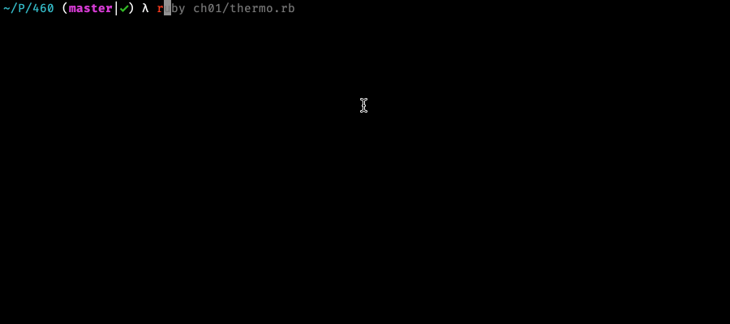
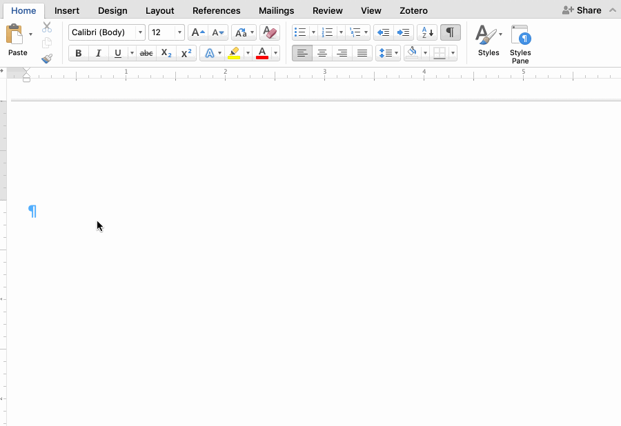

# Overview

This reading will introduce you to the idea of data, as a computer sees it. We will be discussing:

1. Definitions of data
1. Why data matters to writing
1. Different forms of data on a computer
1. How writing becomes data

# Definitions of Data

## Variables

Without getting a lot of technical detail, computers store data in memory in fixed locations. So, if I say to the computer "Here, hold all this data for me," the computer will place the data I provide it in a particular part of its memory. Later, when I come back to the computer, I can say things such as "Hey, remember that data I gave you? Update it for me" or "Give me back that data I gave you."

How the computer stores data in memory is not something most people want to know anything about. When we interact with a computer to open a document we are editing or to change a spreadsheet or even to play a different song, we don't want to have to care about where this data lives. At a basic level, mostly out of our sight, this data is managed by what are called "variables" in computer programming. It's a term for a named location in memory. We don't need to know where it is and usually we don't want to know. File names on your computer, along with folders, are ways of defining variables: it's a term for a location with meaningful data in it.

# Forms of Data

Data comes in many different forms on a computer, however, we can differentiate a few basic kinds of data. Roughly speaking, data can be divided into:

1. Scalar types
1. Compound types

## Scalar data

"Scalar" is a term from algebra that refers to single values. The simplest kind of scalar data to a computer would be a number. Things like `9` or `14.5` are numerical scalars. Because numbers are very important to computers, `9` is a type of numerical scalar called an "Integer" (it doesn't have any fractional data) while `14.5` would be a "Float" (or floating point number, that does have a fractional value).

There are other kinds of scalar values for computers, but they all ultimately derive from numbers. 

A popular type of scalar in computer programming is called a "boolean." booleans can either be `true` or `false` and are used to represent the results of tests (the question "Is 14 greater than 9?" would be represented in a computers as a boolean scalar, which would be `true`) and to make decisions (computer programs are largely about making decisions based on the truth or falsehood of a set of conditions).

However, in early computer programming languages that did not recognize a boolean as a unique kind of data, `1` and `0` can also be used to represent `true` and `false` (with `1` being `true` and `0` being `false`). This is what I mean about scalars ultimately being numbers. Truth and falsehood in computers are just a bunch of `1`s and `0`s.

## Compound Data

How do we represent, say, a variable that changes over time using a scalar? We could create new variables each time the variable changes, but what if our data changes often? How would we look at it all in one place?

This is where compound data enters into the picture. Compound data represents collections of data, pieces of information we have chosen to link together, for whatever reason.

### List Compound Data

Imagine we are cooking a pot roast. It takes a while, and we're lazy. We have a [probe thermometer](https://images-na.ssl-images-amazon.com/images/I/61mFSRa7LbL._AC_SL1500_.jpg) stuck into the roast that is also connected via Bluetooth to our phone. Our phone will read the temperature of the roast every 30 seconds or so until the temperature reads 145°F for a certain number of times in a row. When it reaches that threshold, our phone will signal that our roast is cooked.

If the phone records every temperature reading in one variable (one place in memory), we would have what is generally referred to as a "list" of data. Lists are sequential data, meaning they represent a sequence of values, in this case the list of temperatures read by our thermometer as our roast cooked.

In the GIF below, you can see a simulated run of a program that might read from a thermometer as we bake something. It reads temperature data from the thermometer and stores it in a list of temperatures:

<figure>
	
	<figcaption>Simulation of a thermometer measuring the temperature of a roast</figcaption>
</figure>

Lists are the most common compound data type on a computer. Many things can be represented as lists. We could have a list of boolean values representing a number of coin flips, with `true` equal to heads and `false` equal to tails.

When thinking about data, it is also sometimes important to ask what information we know *about* the data, in addition to the data itself. This information about data is called "metadata," which we will discuss more in a future reading. However, if we wanted to know what we know about a list (in other words, its metadata), the only thing we know about each individual piece of data in a list is its position in the list, which is called an index. If I have a list that has four temperature values, such as `[105.6, 105.7, 105.4, 105.9]`, we can say that `105.6` is at index `0`, `105.7` is at index `1`, `105.4` is at index `2`, and `105.9` is at index `3`. Why start with index `0`? Because computers are just like that (it has to do with how lists were physically stored in early computer members).

But the index of each piece of data and the data itself are all we know about each element of a list. The only thing we know about the list as a whole is its size. Our example has a size of `4`.

That said, we can still do a lot of things with lists. For instance, we can sort them from lowest to highest or highest to lowest. We could also filter a list, removing elements we don't want. Lists are easy to work with because you do not have to know any information about them. Starting at index `0`, increasing the index by `1` each time you get a piece of data from the list, and stopping when the index you ask for is equal to or greater than the list's size, is all you need to process every item in a list.

Everyday examples of lists include things such as data on a pedometer or other fitness trackers, stock prices recorded throughout the day, or even something like what you need from the store.

Lists can also contain other lists, making them multidimensional. Spreadsheets are examples of multidimensional lists, with each row (or column) being a list and each cell within the list being an entry in that list.

As we'll see below, lists are also important to how we represent text as data.

### Dictionary Compound Data

A "dictionary" is the second common type of compound data. Think about how a print dictionary works. You need to look up the meaning of the word. You go to the word's entry in the dictionary. You find the entry on the page. You read the definition.

If we can abstract from this example and think in terms of data, a printed dictionary is a structure for associating two pieces of information: a word and a definition. It also provides a convenient means of finding entries through alphabetization.

Dictionary data on a computer works similarly: scalar data is associated with particular "keys" that provide a particular place to store data. They are often used to describe structured data, or data that has a predictable shape.

Consider this sample Texas A&M ID card:

<figure>
	
	<figcaption>A Sample Texas A&M ID Card</figcaption>
</figure>

What scalar values do you see on the card?

Here's what I find:

1. Name -- "Reveille IX"
1. Title -- "First Lady of Texas A&M"
1. UIN (University Identification Number) -- 123456789
1. Photo -- \<Picture of a Dog\>

When you first got your university ID card, the ID card office most likely accessed a database of students at A&M and generated your card from the information. They were accessing a particularly powerful form of dictionary data called a database server (a database is actually a list of dictionaries).

If we just imagined each record in the database as a dictionary, the dictionary might have four keys: `name`, `title`, `uin`, and `photo`. `name` and `title` would contain text scalars, `uin` would contain a number scalar, and `photo` would contain what's called a `blob` (which is a scalar that represents big files like images).

Now, whenever we need to make an ID card, we can get the record associated with a student's name by searching for dictionaries that match `name` or associated with a student's UIN by matching `uin` keys.

Unlike a list, where metadata is limited to the position of each point of data in a list (and could change if the list gets sorted alphabetically or something), dictionaries have fairly complex metadata because each scalar element has a key that marks out its purpose and its contents.

### Combining Lists and Dictionaries

Most digital applications end up combining list and dictionary data. For instance, a shopping cart on an e-commerce site might track what you are buying with a dictionary with two keys: `user-id` and `contents`. `user-id` would be a scalar representing your unique identification within the system. `contents` would contain a list of what you are buying. Each item in `contents` might itself be dictionary, each with two keys: `quantity` and `product`. The `product` key might contain the name of what you are purchasing ("Today, I'm buying prunes and super glue") while `quantity` tracks how many units of each product you are planning to purchase ("one bag of prunes, three tubes of super glue").

By thinking in terms of scalars, lists, and dictionaries, we can start to think about what kind of data any digital artifact is using.

# Why Data Matters to Writing

"So data types are undeniably cool, but what does this have to do with writing?," you may ask.

And that's a good question!

The philosopher Walter Ong, in his classic *Orality and Literacy*, argues that writing not only fundamentally changed the nature of knowledge but also radically altered our basic understanding of language itself. He claims that in oral cultures, which is to say ones that have not yet introduced or discovered writing, language is understood in terms of time, because speaking is something that happens and as soon as it happens it is gone.

Ong says this is hard for us, living in a literate society, to understand. Writing means that, for us, language is fundamentally different. It is spatial instead of time-based. When we speak, we are merely referencing words that exist outside of our speaking them and are concrete objects we can think about independently of the act of speaking. We can think this way because when we write, words become visual instead of primarily existing as sound. The word is there on paper.

Ong's thesis has a lot of important ramifications for the history of rhetoric. Specifically, the idea of rhetoric emerges from literariness: once words are outside of the moment of speaking, concrete objects on paper, we can play around with order and say things better.

Also in *Orality and Literacy*, Ong claims that electronic media are changing this understanding of the word as concrete. Ong is mostly concerned about things like radio or television making the word become primarily sonic again, instead of a concrete object, but computers have also disrupted this understanding.

Think about it like this: what does writing today have to do with writing?

That may sound a bit cryptic, but I mean this: is typing on a computer writing? Your answer, "yes," is because we have an idea that writing is about using words to communicate, but my answer, "maybe not," is because what does typing on a computer keyboard and having the words represented by glowing phosphors in a liquid crystal matrix have to do with scratching with a pen on paper?

It turns out this question is particularly relevant at the level of data, as well.

Consider writing in cursive, which is maybe something you learned in grade school. Here's an example of my very bad cursive writing:

<figure>
	
	<figcaption>Writing in Cursive</figcaption>
</figure>

Writing in cursive, words are composed of a few smooth motions, with each letter blurring into the other in a smooth flow of the pen. Even when cursive is as inept as mine, it still has this quality of an uninterrupted flow.

Now think about writing in print. Even though the individual letters are discrete, they are still composed of individual marks, individual gestures made by hand. The first downward stroke of the "H," followed by a cross bar and another downward stroke. Writing is still about making gestures in time, even if words have a more concrete dimension.

<figure>
	
	<figcaption>Writing in Print</figcaption>
</figure>

Now, think about writing the same message on a keyboard. I peck keys on a keyboard, choosing letters from a pre-defined list on a grid in front of me. This is not the same idea of gesture. Each letter requires the same number of movements (unlike how an "H" is three strokes with the pen, while an "o" is a single circle).

<figure>
	
	<figcaption>"Writing" "on" "Screen"</figcaption>
</figure>

# Plain Text: Writing as Data

# Plain Text: Data as Writing

When we were talking about [combining lists and dictionaries](#combining-lists-and-dictionaries) to make a simple representation of a shopping cart, the description I produced of a list of dictionaries with lists in them was pretty complicated. It turns out English prose is not great at describing complex kinds of data. Thankfully, computer programmers have developed a variety of ways of representing data to computers. Some of these forms are pretty indecipherable to most humans. Others are easily read by humans but difficult to understand by a computer.

One plain text format, called JSON (JavaScript Object Notation), attempts to do both: describe data to a computer but in a way that humans can also understand.

In JSON, our shopping cart would look like this:

~~~json
{
	"user-id": 12587603,
	"contents": [
		{
			"product": "Prunes",
			"quantity": 1
		},
		{
			"product": "Super Glue",
			"quantity": 2
		}
	]
}
~~~

Check the description from the earlier section again. We have a list (represented by the `{` and the `}` at the beginning and end of the file) with two keys `user-id` and `contents`. In JSON, individual key/value pairs in a dictionary are separated by commas. A key is always a string, and is separated from the value by a colon (`:`). `user-id` contains a numerical scalar, while `contents` contains a list (represented by the `[` and `]`). As with dictionaries, in JSON, entries in a list are always separated by a comma.

The list at key `contents` contains two dictionaries, representing two items in my shopping cart. Each item has two keys, `product` and `quantity`, showing what I'm buying and how many I plan to purchase.

JSON is a short-hand way of representing data that is more visual than English prose, but is still understandable by a computer. It is also an example of a particular file type. Though it is just plain text, JSON is formatted in a particular way so that the computer knows how to read the information it contains.

We will read more about file types next week.

Your hands-on assignment on Wednesday will ask you to think more about data structures for visualizing data. For now, try your hand at describing something digital using JSON. You can create JSON files on your blog, just create a file with a `.json` extension, and you can also use [this site](https://jsonlint.com) to check if you produced valid JSON.
