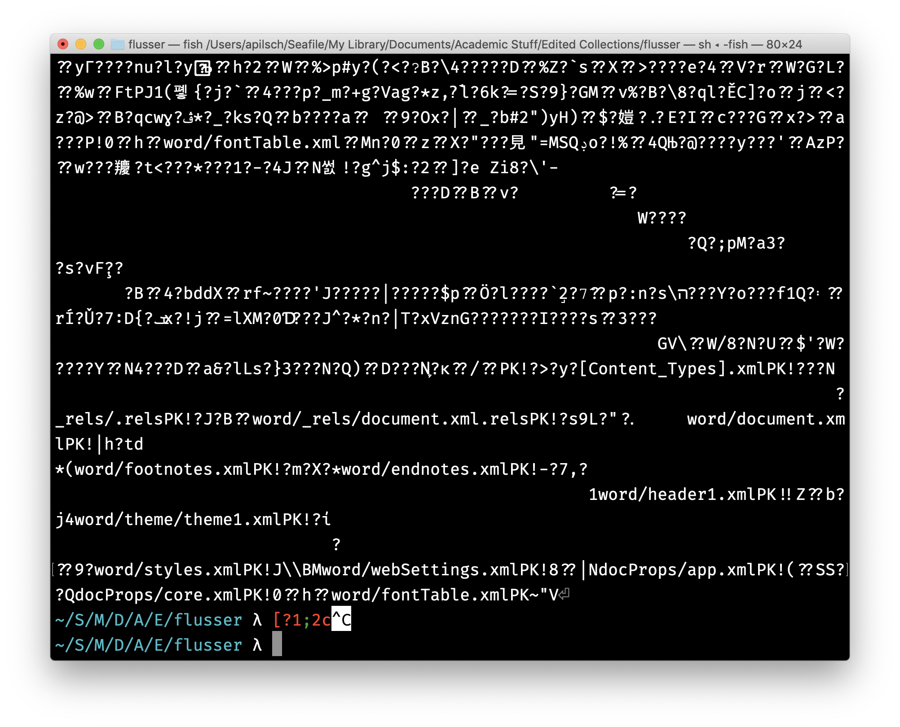
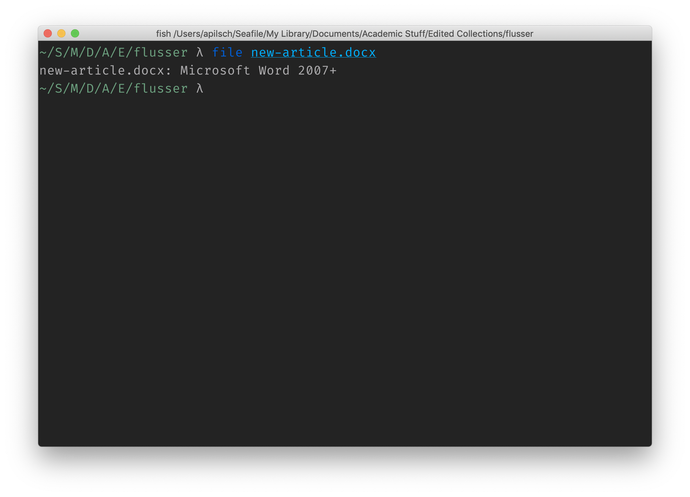
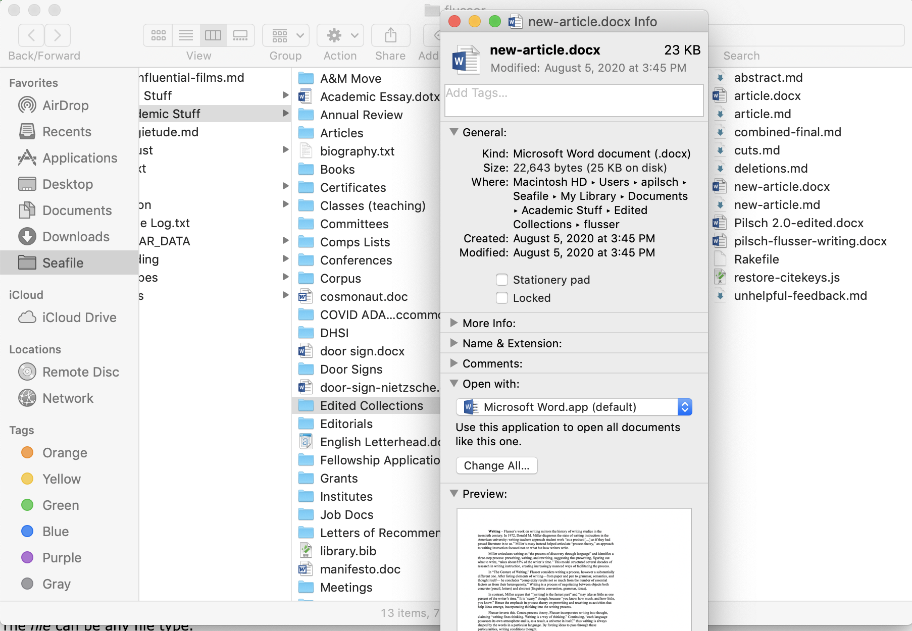
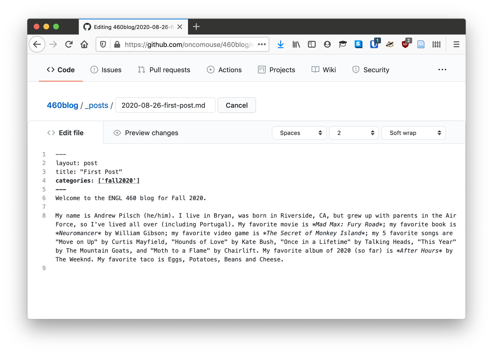
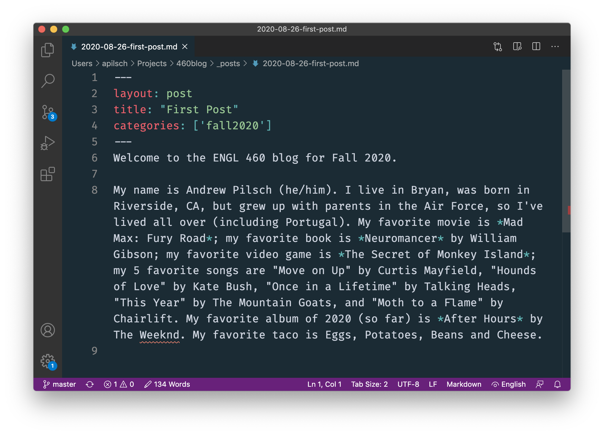

# Overview

Last chapter, we discussed data, which is a fundamental concept for digital authoring. Data is often encountered, on a day to day basis, in terms of files. The idea of a file was developed as a convenient way to manage and organize data for computers.

In this chapter, we will explore

1. Files as a metaphor for the data on a computer
1. Different types of files
1. Plain text as a special type of file
1. Editing and viewing plain text files

# Files and Folders

On our computers, data is organized into files that are themselves placed in folders (which themselves are in more folders). This paradigm, developed from the early use of computers in offices as document management systems, is a metaphor for how data is organized on our disk, a physical organization of electrons to which we are not privy nor would we be likely able to understand. Once again, we see how metaphor is an important operation in understanding what computers do. We use more a understandable metaphor (folders and files) to think about something less understandable, namely the physical operation of the computer.

Other metaphors may help understand the file and folder metaphor, however. Sometimes, in computer science, the file system---the collective name for all the files and folders on a computer disk---are thought of as a tree. Each folder is a branch. Like a tree, branches can contain other branches (more folders) but also can contains leaves (which are files in this metaphor). Files are leaves because, unlike folders, they contain individual pieces of data instead of containing other files or folders. They are the ends of the branch. The other end of the tree---the base of the file system---is called "the root." On a Macintosh, this is the special directory `/`. On a Windows machine, each disk in the computer has a root, so `C:\`, the base of the `C` or main drive, is the root.

Files and folders are what is known as a "hierarchical system," and can be visualized using another metaphor, the hierarchical nature of a family tree. Except for the file system room, each file or folder has a parent. The parent is the folder where the file or folder is housed. A file's parent will also have a parent and so on, until you reach the root of the file system. Folders, as they can contain other folders and files, will also have children. The contents of a folder is that folder's child. You can navigate around a file system by thinking in terms of parents and children.

Thinking hierarchically about files and folders, also reminds us that we can think of a file system as a data structure, like the kinds we read about last chapter. Each file and folder in a file system is a dictionary that contains the file or folder's name. A file will also have a dictionary key for the file's contents. A folder will have a key for children, which will be a list of other file or folder dictionaries.

For instance, if we have a folder called `Documents` that contains another folder called `ENGL 460`, a file called `notes.md`, a file called `schedule.html`, and a folder called `report.docx` inside of `ENGL 460`, we could represent it as a dictionary using JSON:

~~~json
{
	"name": "Documents",
	"children": [
		{
			"name": "notes.md",
			"contents": "My notes"
		},
		{
			"name": "schedule.html",
			"contents": "<html><head><title>Schedule</title></head></html>"
		},
		{
			"name": "ENGL 460",
			"children": [
				{
					"name": "report.docx",
					"contents": "word"
				}
			]
		}
	]
}
~~~

This data structure could be extended infinitely further down, by adding more folders inside of folders inside of folders, but it could only be extended up until we reached the root of the disk, which is a folder that does not have a parent.

Traditionally, the location of files on a disk has been represented by a very compact string format known as a file path. In a file path, the root of the disk is a `/`. After this first slash, the name of the child of the root will be typed and if that itself is a directory, it will be followed by a slash. This process of appending file or folder names with slashes continues until the file we wish to recognize is reached.

For instance, this file is currently in `/Users/apilsch/Projects/courses/2020/engl460fall2020/02-file.md` on my computer. `Users` is a directory under root at the base of my file system. Within that, `apilsch` is my home directory, and then I store all my GitHub work in a `Projects` directory. `courses` is the name of this project, it is in the `2020` directory because I sort courses by year, then a folder for our course, until we finally get to the name of the file, which is `02-file.md`. So file path notation is another way to represent files on a disk.

Relatedly, let's look at the URL for this page (the address in the bar of our browser): `https://oncomouse.github.io/courses/2020/engl460fall2020/02-file.html`. What do you notice that seems familiar about this?

Is it a coincidence that `/courses/2020/engl460fall2020/02-file.html` is repeated between both the URL of this website and the file path on my computer?

It isn't, because URLs also represent file paths, but represent file paths of remote computers. `oncomouse.github.io` is a computer somewhere hosted by GitHub. Your browser tells that machine it wants the file `/courses/2020/engl460fall2020/02-file.html`. GitHub's computer goes to look for that file, finds it exists, and gives the contents to your browser to display.

When I edit this file on my home computer, I create a local copy of what is on the GitHub server on my computer. This local copy has the same file system structure as the remote GitHub computer you accessed. So, it is unsurprising then that the file path on my computer and the file path on GitHub's computer would be the same. They are copies of the same data, the same file structure. All I do is edit the files on my local computer, because I don't have access to edit them directly on GitHub, and send them back to the remote server. We will read more about how to do this in coming weeks.

You may have noticed, if you were reading carefully, one key difference between the file path on my computer and the URL for this chapter: `.md` and `.html` at the end of the two locations. What has changed here? This part of the file path tells me that there are two different types of a files, one containing Markdown and one containing HTML. We can now talk about what this difference is and why it matters.

# Types of Files

Remember when we tried to look at the content of a Word document last week and all we saw was a bunch of unreadable characters. Here's that image again, in case you want a refresher:

<figure>

<figcaption>The incomprehensible results of trying to view the source of a Microsoft Word Document</figcaption>
</figure>

We talked about how, for a computer, all data is an interchangeable stream of 1s and 0s, with an MP3 audio recording treated the same as a novel manuscript. If that's so, then how does our computer know to open all that confusing mess in Microsoft Word when we double click it?

And, we can verify that my computer knows the document is an MS Word file in a couple of ways.

Using the command line, I can run the old UNIX `file` command, which tells me:

<figure>

<figcaption>The document is of type `Microsoft Word 2007+`</figcaption>
</figure>

If I right click (or <kbd>control</kbd>+click) on the file in macOS's Finder, I see similar information displayed:

<figure>

<figcaption>Document kind is `Microsoft Word Document`</figcaption>
</figure>

In both the command line and the visual representation, my computer knows that collection of unreadable symbols was an MS Word document.

How does it do that? The manual for the `file` command run in the first example lists the following steps taken to identify an unknown file:

1. If *file* does not exist, cannot be read, or its file status could not be determined, the output shall indicate that the file was processed, but that its type could not be determined.
1. If the file is not a regular file, its file type shall be identified. The file types directory, FIFO, socket, block special, and character special shall be identified as such. Other implementation-defined file types may also be identified. If *file* is a symbolic link, by default the link shall be resolved and *file* shall test the type of file referenced by the symbolic link.
1. If the length of *file* is zero, it shall be identified as an empty file.
1. The file utility shall examine an initial segment of *file* and shall make a guess at identifying its contents based on position-sensitive tests.
1. The file utility shall examine *file* and make a guess at identifying its contents based on context-sensitive default system tests. (The answer is not guaranteed to be correct.)
1. The file shall be identified as a data file.

It's interesting how many times that description uses the word "guess," isn't it? Because computers don't differentiate between data unless we tell them to, they have no way of knowing for sure what any given file actually contains. They're not smart in that particular way.

Instead, though, the computer "shall examine an initial segment" or the contents of the entire file to make a best guess. It can do this because, even if a file like a word document looks undecipherable to us, it has a particular form. The form of a word document (after 2007 when the `.doc` extension became the `.docx` extension by default) is managed by the [Office Open XML Standard](https://www.ecma-international.org/publications/standards/Ecma-376.htm), itself managed by Ecma, an organization whose purpose is to manage the development and dissemination of such computer standards (we encountered two other standard organizations when we read about ANSI and Unicode in the last chapter).

If you were to read what is a very long standard document (though not terribly long as standards go), you could read the entire specification of features and formats required by any program that wishes to read MS Word documents. Making a computer program capable of reading such a file is called "implementing a standard." Standards have a long and important history in modern life, as the International Organization for Standards (or ISO) governs things such as the size of shipping containers, which in turn governs the size of the boxes of most things you buy. Most things in modern life are the subject of standards, not just computer programs.

A standard allows for a computer to identify a file. The MS Word document contains information at the front of the file telling my computer what it is, so it can read the beginning of the file to determine what the file is.

However, not all files on my computer are governed by international standards-making bodies. My computer still knows how to open them, though. Another important feature of the file system is the extension. This is the information that comes after the final period (or "dot") in a file's name. So, for instance, on our website `_config.yml` is identified as containing YAML because the `.yml` extension means "this file contains YAML" while our `index.html` file has a `.html` file extension to tell our computer "this file contains HTML." Using extension to figure out file content is what the manual for the `file` command meant by guessing from "context" in point 5, above. Extension is often the only way to tell file type, but it can be unreliable because, unlike the contents of a standardized file, extension can be changed by the user.

Of course, extensions are necessary for many of the files we will be using in this course, because for files whose contents we can look at directly, that is the "plain text" files we have been talking about, extension is often the only way a computer can know what is in the file. This is because, even though the data (that is the string of plain text contained in the file) does not change between a `.md`, `.html`, or `.yml` file extension, all three of those files format their plain text differently, so that programs that read YAML can read the data.

Let's talk more about those differences.

# Plaintext File Types

Remember last week, when we were talking about a [shopping cart and how to describe it](#combining-lists-and-dictionaries)? We saw some JSON notation meant to represent our shopping cart. It looked like this:

~~~json
{
	"user-id": 12587603,
	"contents": [
		{
			"product": "Prunes",
			"quantity": 1
		},
		{
			"product": "Super Glue",
			"quantity": 2
		}
	]
}
~~~

When we were creating our blogs, we edited a file called `_config.yml`. The `.yml` extension tells the computer that `_config.yml` is a text document containing YAML information. YAML stands for "YAML Ain't Markup Language" because computer people have weird senses of humor, but it is another way of describing data to a computer that is also readable by humans. If we wanted to write our shopping cart in YAML instead of JSON, it might look like this:

~~~yaml
---
user-id: 12587603
contents:
  - product: Prunes
    quantity: 1
  - product: Super Glue
    quantity: 2
~~~

YAML uses a more compressed way of expressing data (called a "syntax" in computing) but represents the same data. If you don't believe me, [check either the YAML or JSON in this online converter](https://www.json2yaml.com/convert-yaml-to-json).

As we've been discussing, plain text is one way of expressing data. However, plain text can be formatted differently, telling the computer different ways to interact with the same basic, string data.

We have encountered three kinds of plain text files on our [Jekyll](https://jekyllrb.com) sites. In the tutorial, we created `.html`, `.md`, and `.yml` files. The `_config.yml` file uses YAML, which we discussed, above, while the `.md` and `.html` files contain content and layout information for our site. HTML is the "HyperText Markup Language," which is the basic language that describes every element on a website. Markdown is a simple document description language that your computer converts into HTML out of your site.

We will talk more about HTML and Markdown in future weeks, but one thing to note now is the important insight Markdown can grant us into why plain text file formats are so powerful and learning to think in terms of plain text is so important to understanding digital writing. Consider the paragraph above as it exists in the HTML code your browser is using to show this chapter:

~~~html

We have encountered three kinds of plain text files on our <a href="https://jekyllrb.com">Jekyll</a> sites. In the tutorial, we created <code class="language-plaintext highlighter-rouge">.html</code>, <code class="language-plaintext highlighter-rouge">.md</code>, and <code class="language-plaintext highlighter-rouge">.yml</code> files. The <code class="language-plaintext highlighter-rouge">_config.yml</code> file uses YAML, which we discussed, above, while the <code class="language-plaintext highlighter-rouge">.md</code> and <code class="language-plaintext highlighter-rouge">.html</code> files contain content and layout information for our site. HTML is the “HyperText Markup Language,” which is the basic language that describes every element on a website. Markdown is a simple document description language that your computer converts into HTML out of your site.

~~~

And the same paragraph in the Markdown file I wrote it in:

~~~markdown
We have encountered three kinds of plain text files on our [Jekyll](https://jekyllrb.com) sites. In the tutorial, we created `.html`, `.md`, and `.yml` files. The `_config.yml` file uses YAML, which we discussed, above, while the `.md` and `.html` files contain content and layout information for our site. HTML is the "HyperText Markup Language," which is the basic language that describes every element on a website. Markdown is a simple document description language that your computer converts into HTML out of your site.
~~~

Can you spot the differences?

There are many. The biggest difference is the HTML has what are called HTML "tags," which are special commands that tell your web browser what the data contained in each tag is, and therefore how to display it. The link to Jekyll is `<a href="https://jekyllrb.com">Jekyll</a>` in the HTML. The `<a>` tag tells your browser that "Jekyll" is a special piece of text called an "anchor". The part that reads `href="https://jekyllrb.com"` is a property added to the anchor, telling your browser where the anchor leads. Anchor tags such as this one are how all links on all websites  are made.

But there are several other differences between the HTML and the Markdown. For instance, note the quotation marks around "HyperText Markdown Language." In Markdown, `"HyperText Markup Language,"` becomes `“HyperText Markup Language,”` with the fancy quotations. This makes it possible to type without fancy characters and have them appear in our finished document. Markdown will also convert `--` to – and `---` to —.

An additional difference to note: the beginning and end of the paragraph in the HTML version are marked with paragraph HTML tags (`
` and `
`). This mark has to surround every paragraph in this document. There are 10 paragraphs already in this chapter, and more below. As I am using Markdown to write with (rather than worry about how particular elements such as a menu or a logo are displayed), having to mark each paragraph with `
` and `
` is a lot of work and distracts me from the important work of what I'm doing at the moment: writing.

The nit-picking distraction of HTML is why Markdown was created. On the one hand, you could look at Markdown and say "web designers made this because they are lazy" (and you wouldn't be wrong) but more expansively, you could argue that Markdown was created because having to type HTML tags and properties while writing is a distraction. Markdown is HTML minus the layout elements and focused on content-creation.

Similarly, YAML is a data description language focused on ease of human reading and simple syntax. JSON is a similar language that is less easy to read but much easier to parse by computer. JSON syntax is much pickier than YAML's and a bit hard to write. Both formats have been created for different purposes, even though they are both plain text.

And this is the power of plain text. We are always writing in the same way, in the same program, but we are writing using different formats which serve different purposes.

## Reading and Writing Plain Text

Now that we've learned a little about what files are to our computers and how plain text is a great tool for the modern, digital author, the question you might ask is "how do I work with plain text?"

When you want to write a document for a class, you usually open Microsoft Word or Google Docs. They are both editors designed to work with word processing files. When you want to record a video, you may open a program such as [OBS](https://obsproject.com/) or iMovie. Editing images can be done in programs like Adobe Photoshop or MS Paint. Each of these programs have a dedicated editor for the type of file you want to work on.

The same is true of plain text. There are myriad of plain text editors available on most modern computers. Windows has the venerable "Notepad," while macOS ships with "Text Edit." When you edit your blog on GitHub, you are also using a text editor.

<figure>

<figcaption>GitHub as a text editor</figcaption>
</figure>

While GitHub is great for quickly editing texts, web browsers as a rule (outside of dedicated apps such as Google Docs) are not great for writing. Like Notepad or Text Edit, GitHub's editor does not offer a lot in the way of features. It does indent things for us and it does highlight syntax when we need it.

However, most people who work on webpages use some kind of dedicated text editor designed to enhance their workflow. Again, as I said, webpage developers, like most programmers, are inherently lazy. Or, putting it more nicely, they are focused on the ideas of their work that they do not want to fight with a complicated interface. Instead, they look for tools that help enhance their workflow.

Ultimately, in this class, we will be moving toward working with an industrial-strength text editor, most likely [Microsoft Visual Studio Code](https://code.visualstudio.com/) (if you prefer a different text editor, feel free to use it). Here is the same blog post above in VSCode:

<figure>

<figcaption>Visual Studio Code, a more advanced text editor</figcaption>
</figure>

## Conclusion
