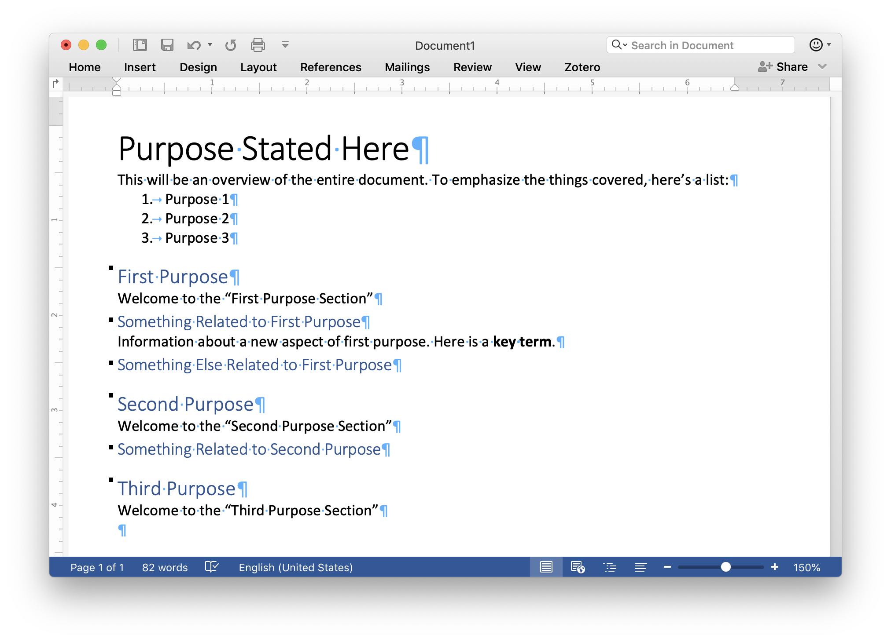
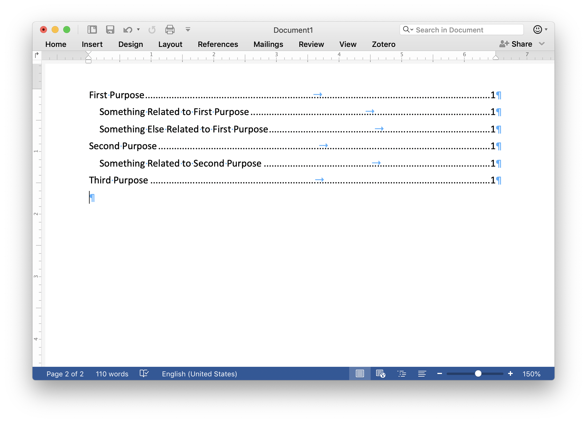

# Overview

Now that we know a little more about files and have some idea of how plain text can be used to encode different kinds of data using file formats, we can begin to learn about how data is formatted for display on the web.

In this chapter, we will explore:

1. Elements of a Document
1. Web Documents: Markdown
1. Semantic Web Documents: HTML

*Note:* This is a very long chapter, so make sure to budget enough time to read it all.

#  Elements of a Document

Think about any document you've ever read. It could be a Word document, a document you created in Google Docs, or an HTML web page you read, on a site such as *Wikipedia*. These documents have certain elements in common, related to how text is formatted and displayed.

Most technical documents use a shared set of elements to convey information quickly and clearly. They are:

1. Lists
1. Headings
1. Images
1. Tables

Additionally, **bold** and *italic* text can be used to add varying degrees of emphasis. When we compose technical documents, we use these elements to drive readers to the information they want, so all these elements are design cues meant to show important information.

<figure>

<figcaption>The Elements of a Document in MS Word</figcaption>
</figure>

The above figure illustrates document elements in MS Word and how they are intended to function. There is a title at the top that gives overview of the document's purpose or nature or content. A list outlines the major points of the document. We have three level 1 headings that announce major sections of the document (related to the list in the introduction). Those level 1 headings have level 2 headings below them that announce sub-sections, or divisions inside the major divisions.

Given what we know about file formats, we could think about these design elements as a kind of file format for human (rather than machine) readers. Years of reading textbooks and other technical documents has taught us that lists emphasize important groups of data, emphatic formatting such as bold or italic introduce key terms, and increasingly small headings break the document into related sections and subsections.

Of course the visual hierarchy introduced by different headings can also be used as data by a machine. In MS Word, for instance, we can insert a document Table of Contents which generates a visual aid for navigating our document based on the hierarchy of headers we have created. The figure below illustrates one for the word document in the earlier figure:

<figure>

<figcaption>A Simple Table of Contents Generated by MS Word</figcaption>
</figure>

Word can generate these tables of contents because it can interpret our hierarchy of headers as a kind of nested data structure (like the file system we talked about in the last chapter) starting with the document title as a root, with level 1 headings and level 2 headings in a branch and leaf relationship like a file system tree.

## That But Online

HTML, the language websites are written in, is equipped to describe documents in a similar manner to the visual hierarchy of MS Word. [Click here to see the content of the demo Word document rendered in HTML](./03-markup-example.html).

It looks pretty bad, right? HTML without any styling is pretty rugged. We will talk in a future chapter about how to fix this.

But you can see in that site the same basic principles as before. We have hierarchical information and we use lists and emphasis to highlight important information. We could add some code to our site to generate a table of contents if we wanted, too.

The big difference between HTML and a program like MS Word is what we talked about in the last chapter: HTML is plain text, which means we can look at the source code that our web browser is using to generate the page we are seeing. If you right (or control) click on the simple example page in your browser, there should be a menu option that says something like "View Page Source." Clicking on that will open the document source, showing you the page's HTML. I've included it below as well:

~~~html
<html>
<head></head>
<body>
  <header>
    <h1>Purpose Stated Here</h1>
    <p>This will be an overview of the entire document. To emphasize the things covered, here’s a list:</p>
    <ul>
      <li>Purpose 1</li>
      <li>Purpose 2</li>
      <li>Purpose 3</li>
    </ul>
  </header>
  <article>
    <h1>First Purpose</h1>
    <p>Welcome to the “First Purpose Section”</p>
    <h2>Something Related to First Purpose</h2>
    <p>Information about a new aspect of first purpose. Here is a <strong>key term</strong>.</p>
    <h2>Something Else Related to First Purpose</h2>
    <h1>Second Purpose</h1>
    <p>Welcome to the “Second Purpose Section”</p>
    <h2>Something Related to Second Purpose</h2>
    <h1>Third Purpose</h1>
    <p>Welcome to the “Third Purpose Section”</p>
  </article>
</body>
</html>
~~~

There is a lot of stuff there that we don't see! All those words set off in `<` and `>` characters are called tags. We will talk about them below.

The thing to note here is that if you had to type `<p>` every time you started a paragraph in an essay you were writing and `</p>` every time you finished a paragraph, you would soon grow weary of it. This impatience with typing out these tags is why visual editors such as MS Word (which are referred to as ["WYSIWYG"](https://en.wikipedia.org/wiki/WYSIWYG) editors) were first developed.

However, as we will discuss below, some crafty web developers first produced Markup to get around having to use a visual editor for HTML (which, and I cannot emphasize this strongly enough, are all terrible) and to get around having to produce the tags for common document elements such as paragraphs, headers, links, lists, and tables.

Let's talk about Markdown.

#  Simple Plain Text Documents for the Web: Markdown

Here's the same document we have seen in MS Word and HTML rendered in Markdown:

~~~markdown
---
title: Purpose Stated Here
---
This will be an overview of the entire document. To emphasize the things covered, here’s a list:

1. Purpose 1
1. Purpose 2
1. Purpose 3

# First Purpose

Welcome to the "First Purpose Section"

## Something Related to First Purpose

Information about a new aspect of first purpose. Here is a **key term**.

## Something Else Related to First Purpose

# Second Purpose

Welcome to the "Second Purpose Section"

## Something Related to Second Purpose

# Third Purpose

Welcome to the "Third Purpose Section"
~~~

That is much simpler!

Markdown works by assuming you are writing a paragraph, so any block of text set off by a blank line defaults to being tagged as a paragraph.

## Block Elements

In Markdown, a paragraph is the simplest form of a "block". A block is any group of linked elements. Other blocks in Markdown include:

1. Headings
1. Lists
	* Bulleted (or Unordered)
	* Numbered (or Ordered)
1. Blockquotes
	* Used to quote material from another source
1. Code
	* Used to show computer code
1. Images
1. Rules

Blocks that are not paragraphs (lists and blockquotes) are formatted by starting each line of the block with a special character, indicating its function.

### Headings

A **heading** can be given a hierarchical level as in HTML and MS Word. Like those platforms you can define headings from 1 (the top-most hierarchy) through 6 (the lowest). To define a header, begin a block with a number of octothorpes (`#`) equal to the heading level followed by a space. So a block that starts `# ` will be a level 1 heading, while a block that starts with `#### ` will be a level 4 heading.

~~~markdown
# Level 1 Heading

## Level 2 Heading

### Level 3 Heading

#### Level 4 Heading

##### Level 5 Heading

###### Level 6 Heading
~~~

The above code will produce:

# Level 1 Heading

## Level 2 Heading

### Level 3 Heading

#### Level 4 Heading

##### Level 5 Heading

###### Level 6 Heading

### Lists

A **list** is either started with an asterisk (`*`) or a number (`1.`). Each new line in the block is a new list item. With ordered lists, the numbers can be sequential (`1.`, `2.`, `3.`, etc.) but it is not required. To facilitate ease of use, most Markdown writers just number everything one (`1.`) so if you change the order of your bullet points, you don't have to renumber everything to keep your source code neat. The numbers you write for Markdown bullets have no effect on how they are numbered in HTML.

If your list is multilevel, you can indent the sub points using a tab or multiple spaces before the heading. You can also mix ordered and unordered lists at different indentation levels:

~~~markdown
1. Numbered List
	* Unordered Sublist
	* Unordered Sublist
	* Unordered Sublist
1. Numbered List
	1. Ordered Sublist
	1. Ordered Sublist
	1. Ordered Sublist
1. Numbered List
~~~

The above code produces:

1. Numbered List
	* Unordered Sublist
	* Unordered Sublist
	* Unordered Sublist
1. Numbered List
	1. Ordered Sublist
	1. Ordered Sublist
	1. Ordered Sublist
1. Numbered List

### Blockquotes

A **blockquote** is started with a greater than sign (`>`). Some Markdown writers like to insert new lines in their paragraphs every 80 characters, to facilitate orderly source code. This works in paragraphs, but in a block quote, if you do so, each line of the block quote must start with `>`. Here's an example:

~~~markdown
> Fourscore and seven years ago our fathers brought forth, on this continent, a
>new nation, conceived in liberty, and dedicated to the proposition that all men
>are created equal. Now we are engaged in a great civil war, testing whether
>that nation, or any nation so conceived, and so dedicated, can long endure. We
>are met on a great battle-field of that war. We have come to dedicate a portion
>of that field, as a final resting-place for those who here gave their lives,
>that that nation might live. It is altogether fitting and proper that we should
>do this. But, in a larger sense, we cannot dedicate, we cannot consecrate—we
>cannot hallow—this ground. The brave men, living and dead, who struggled here,
>have consecrated it far above our poor power to add or detract. The world will
>little note, nor long remember what we say here, but it can never forget what
>they did here. It is for us the living, rather, to be dedicated here to the
>unfinished work which they who fought here have thus far so nobly advanced. It
>is rather for us to be here dedicated to the great task remaining before
>us—that from these honored dead we take increased devotion to that cause for
>which they here gave the last full measure of devotion—that we here highly
>resolve that these dead shall not have died in vain—that this nation, under
>God, shall have a new birth of freedom, and that government of the people, by
>the people, for the people, shall not perish from the earth.
>
> --- Abraham Lincoln
~~~

This will produce:

> Fourscore and seven years ago our fathers brought forth, on this continent, a
>new nation, conceived in liberty, and dedicated to the proposition that all men
>are created equal. Now we are engaged in a great civil war, testing whether
>that nation, or any nation so conceived, and so dedicated, can long endure. We
>are met on a great battle-field of that war. We have come to dedicate a portion
>of that field, as a final resting-place for those who here gave their lives,
>that that nation might live. It is altogether fitting and proper that we should
>do this. But, in a larger sense, we cannot dedicate, we cannot consecrate—we
>cannot hallow—this ground. The brave men, living and dead, who struggled here,
>have consecrated it far above our poor power to add or detract. The world will
>little note, nor long remember what we say here, but it can never forget what
>they did here. It is for us the living, rather, to be dedicated here to the
>unfinished work which they who fought here have thus far so nobly advanced. It
>is rather for us to be here dedicated to the great task remaining before
>us—that from these honored dead we take increased devotion to that cause for
>which they here gave the last full measure of devotion—that we here highly
>resolve that these dead shall not have died in vain—that this nation, under
>God, shall have a new birth of freedom, and that government of the people, by
>the people, for the people, shall not perish from the earth.
>
> --- Abraham Lincoln

### Code Blocks

A **code** block is originally defined by starting a block line with tab or 4 spaces. So, to include some Markdown source in our document, we could use the following code:

~~~markdown
	1. Numbered List
		* Unordered Sublist
		* Unordered Sublist
		* Unordered Sublist
	1. Numbered List
		1. Ordered Sublist
		1. Ordered Sublist
		1. Ordered Sublist
	1. Numbered List
~~~

Would produce:

	1. Numbered List
		* Unordered Sublist
		* Unordered Sublist
		* Unordered Sublist
	1. Numbered List
		1. Ordered Sublist
		1. Ordered Sublist
		1. Ordered Sublist
	1. Numbered List

#### Fenced Code Blocks

The one aspect everyone hated about [the original Markdown specification](https://daringfireball.net/projects/markdown/syntax) was using tabs to produce code. Later versions of Markdown implemented something called a fenced code block. These are much easier to work with, though they break the original understanding of blocks as being clusters of lines starting with special characters.

To define a fenced code block, start a block with either three tildes (`~`) or three back ticks (`` ` ``) on a line by itself and end the block with the same, so:

~~~markdown
```
1. Numbered List
	* Unordered Sublist
	* Unordered Sublist
	* Unordered Sublist
1. Numbered List
	1. Ordered Sublist
	1. Ordered Sublist
	1. Ordered Sublist
1. Numbered List
```
~~~

Would become:

```
1. Numbered List
	* Unordered Sublist
	* Unordered Sublist
	* Unordered Sublist
1. Numbered List
	1. Ordered Sublist
	1. Ordered Sublist
	1. Ordered Sublist
1. Numbered List
```

Though not part of the original specification for Markdown, this is pretty widely supported and much easier than the original syntax.

### Rules

Finally, Markdown lets you define horizontal lines, called **rules**, in the standard. A rule is another special block in Markdown. It consists of three hyphens (`---`) on a line by themselves.

~~~markdown
---
~~~

Produces

---

And that's it for block elements!

## Span Elements

Alongside blocks, Markdown defines spans. Spans modify content inside of blocks. These elements include:

1. Italic
1. Bold
1. In-line Code
1. Links
1. Images

### Italic

As we will talk about in the section on HTML, **italic** is technically defined as "emphasis" in Markdown. In practice, emphasis is usually formatted as *italic* font, but it need not be. To produce emphasized text, surround the text you wish to emphasize with single asterisks (`*`).

~~~markdown
Here's a paragraph with an *emphasized group of words*.
~~~

Which will produce:

Here's a paragraph with an *emphasized group of words*.

### Bold

Similar to emphasis, **bold** is technically defined as "strong emphasis" because it may not always be formatted as **bold**, however it usually is. To produce strongly emphasized text, surround the text you wish to strongly emphasize with double asterisks (`**`).

~~~markdown
Here's a paragraph with a **strongly emphasized group of words**.
~~~

Which will produce:

Here's a paragraph with a **strongly emphasized group of words**.

### In-line Code

You can also use **code** inside of other blocks, such as blockquotes, lists, or paragraphs. To do so, surround the text you wish to mark as code with single back ticks (`` ` ``).

~~~markdown
This paragraph contains some code, `**Markdown strong emphasis**`.
~~~

Which will produce:

This paragraph contains some code, `**Markdown strong emphasis**`.

### Links

A **link** can be added to a Markdown document by surrounding the text one wants to make a link with square brackets (`[` and `]`). Outside the closing bracket (`]`), add parentheses (`(` and `)`) surrounding the URL.

~~~markdown
This paragraph [contains a link to my website](https://andrew.pilsch.com).
~~~

Which will produce:

This paragraph [contains a link to my website](https://andrew.pilsch.com).

*Warning:* Make sure to include any punctuation that follows the link outside of the URL. A stray period in a URL will make your link not work correctly.

### Images

An **image** is a link that starts with an exclamation point (`!`) and then contains a link (which we will talk about below). Unlike a link, the display text becomes a textual description of the image (which is crucial for building websites accessible to blind users), while the URL is the location of the image:

~~~markdown

~~~

Which will produce:


This syntax is the same as the link syntax and is a deliberate choice made by the original  designers of Markdown to emphasize the importance of textual descriptions of images for accessibility purposes.

## A Note on the Name "Markdown"

You may have noticed this chapter is on "Markup" and the language you have just learned (!!) is called "Markdown." What's up with that?

"Markup" is a noun and a verb in computer culture. It means to use a predefined set of special characters (like the block and span indicators we just learned for Markdown), called a markup language, to transform a plain text document into more meaningful data for computers to read. HTML stands for HyperText Markup Language and is considered to be a thorough if unpleasant way of describing data to a computer. Markdown, in contrast, was an attempt to simplify content creation in web environments, so it's a de-escalated version of a markup language, hence Markdown.

# Semantic Web Markup: HTML

Given that Markdown is simple and straight-forward, why would anyone ever write anything in HTML? I ask myself this question quite frequently.

HTML is a significantly more complex markup system that allows us more control over the display and structure of content we create for the web. While in Jekyll we mostly will write in Markdown, HTML is useful for implementing design elements in our site, for controlling how things look and what they are, not just what they say.

When I claim HTML lets us define what things are on our site, I am highlighting HTML's nature as a semantic markup language. "Semantic" refers to meaning and explains HTML's capacity to define what something is, rather just how it displays. We may think of things such as headings, lists, and even emphasis or strong emphasis as formatting decisions, but to the web browser (and to readers, too, as we discussed above), these marks define kinds of data.

HTML goes further than the kind of display-related semantic content we can describe in Markdown by structuring content into articles and asides, and by marking things as time information or address related information. These marks in HTML provide further meaning to our documents. It is important to remember, when working with HTML, that what something means is more important than how it looks. We will talk in future classes about those issues.

## An HTML Tag

An HTML document is made up of paired "tags" which we don't see in a web browser but can see when we do a "View Source" on a web page. Tags define block or span elements, like in Markdown. There are also tags that define the structure of the basic document.

Each tag is formatted with `<` and `>` tags. The `<` is followed by an **element name** which defines the kind of tag. [There are many possible elements in the HTML specification, which is currently on version 5](https://developer.mozilla.org/en-US/docs/Web/HTML/Element). There are a few tags, the most famous of which is `img`, that are referred to as ["self-closing"](http://xahlee.info/js/html5_non-closing_tag.html), but beyond those, every HTML tag formats a region of text contained within an **opening** and a **closing** tag. An open tag is defined by the `<`, an element name, and a `>`. A closing tag is defined by a `<`, a `/`, the *same* element name as the opening tag and a `>`.

A paragraph in HTML can be defined by:

~~~html
<p>Paragraph content.</p>
~~~

Note the matching `p` element names and the `/` in the closing tag. Element names can be either lower- or upper-case, though lower is generally the standard today.

HTML tags can also accept attributes, which define optional information about the element in question. The most famous attribute is `href`, which stands for hyperref and defines the URL a link leads to when clicked.

Adding a link to our paragraph above, we write:

~~~html
<p>Paragraph content, that now <a href="http://google.com">contains a link</a>.</p>
~~~

Any scalar value can be contained by attributes but strings have to be quoted. Number values and boolean (`true`/`false`) values do not require quotes in HTML.

## An HTML document

There is one HTML tag that is *required* in any HTML document, and that is `html`, the tag that defines plain text as HTML content.

A valid HTML document, based on our paragraph would be:

~~~html
<html>
	<p>Paragraph content, that now <a href="http://google.com">contains a link</a>.</p>
</html>
~~~

However, in the 21st century, there are a few more elements that should be included in any HTML document, namely `head` and `body`.

These two special tags divided the document into metadata (which we will talk about more in a future chapter) and data, or "information about the content" and the content itself. `<head>` is where information such as the document's title is stored. You cannot set this information in `<body>`.

Making our simple HTML document more robust, we can write:

~~~html
<html>
	<head>
		<title>ENGL 460 - Sample Document</title>
	</head>
	<body>
		<p>Paragraph content, that now <a href="http://google.com">contains a link</a>.</p>
	</body>
</html>
~~~

HTML content goes inside a `<body>` tag, while information about the document goes inside the `<head>`. Remember that and you are well on your way to learning HTML.

Actually, the idea of things having their correct place is important for learning HTML. We put content inside a paragraph when it is a paragraph, we put a level 1 heading before a level 2 heading, the main content of our page goes inside an article, etc. The important thing to remember about HTML is you are telling the computer what your information *is*, not how to display it. If something isn't displaying the way you want, the question to ask is not "why does this look weird?" but "have I described this information incorrectly?"

## From Markdown to HTML

Some tags we have already encountered in Markdown:

*Note*: If you are having trouble with HTML, always, always, always check to make sure your tags are closed and are closed in the proper place and order. It is most likely the cause of the problem you are having.

### Paragraphs

Unlike Markdown, where we get paragraphs for free, we have to define paragraphs in HTML using `<p>` and `</p>` tags.

### Headings

The tag for a heading in HTML is `<h?>`, where `?` can be a number from 1 to 6, so `<h1>` is a level 1 heading, `<h2>` is a level 2 heading, and so on.

*Note:* These headings describe an organization of your document and are especially important in that capacity for screen readers and other assistive technologies. A level 1 heading can be used at the start of any new block element that defines a region of the document, or you can use a consistent leveling hierarchy throughout the document (with 1 being the title, all 2's defining the first headings, etc.). Whichever you choose, consistency is important.

### Lists

Unordered (bulleted) lists are defined as regions by the `<ul>`, while ordered (numbered) lists are defined using the `<ol>` tag. Each item in the list (each item that will be numbered or bulleted) is defined by the `<li>` tag.

Nesting lists is achieved by opening a new list inside of the list item that will become the parent, so to produce the following in HTML:

1. Item 1
	* Sub-item 1
	* Sub-item 2
1. Item 2

You would write:

~~~html
<ol>
	<li>Item 1
		<ul>
			<li>Sub-item 1</li>
			<li>Sub-item 2</li>
		</ul>
	</li>
	<li>Item 2</li>
</ol>
~~~

In my opinion, HTML's confusing list syntax is the single best reason to use Markdown, but I digress.

### Blockquotes

Blockquotes are defined by the `<blockquote>` tag, but within a block quote, you still have to define things like lists or paragraphs, so our Markdown example:

~~~markdown
> Fourscore and seven years ago our fathers brought forth, on this continent, a
>new nation, conceived in liberty, and dedicated to the proposition that all men
>are created equal. Now we are engaged in a great civil war, testing whether
>that nation, or any nation so conceived, and so dedicated, can long endure. We
>are met on a great battle-field of that war. We have come to dedicate a portion
>of that field, as a final resting-place for those who here gave their lives,
>that that nation might live. It is altogether fitting and proper that we should
>do this. But, in a larger sense, we cannot dedicate, we cannot consecrate—we
>cannot hallow—this ground. The brave men, living and dead, who struggled here,
>have consecrated it far above our poor power to add or detract. The world will
>little note, nor long remember what we say here, but it can never forget what
>they did here. It is for us the living, rather, to be dedicated here to the
>unfinished work which they who fought here have thus far so nobly advanced. It
>is rather for us to be here dedicated to the great task remaining before
>us—that from these honored dead we take increased devotion to that cause for
>which they here gave the last full measure of devotion—that we here highly
>resolve that these dead shall not have died in vain—that this nation, under
>God, shall have a new birth of freedom, and that government of the people, by
>the people, for the people, shall not perish from the earth.
>
> --- Abraham Lincoln
~~~

Becomes:

~~~html
<blockquote><p>Fourscore and seven years ago our fathers brought forth, on this continent, a
new nation, conceived in liberty, and dedicated to the proposition that all men
are created equal. Now we are engaged in a great civil war, testing whether
that nation, or any nation so conceived, and so dedicated, can long endure. We
are met on a great battle-field of that war. We have come to dedicate a portion
of that field, as a final resting-place for those who here gave their lives,
that that nation might live. It is altogether fitting and proper that we should
do this. But, in a larger sense, we cannot dedicate, we cannot consecrate—we
cannot hallow—this ground. The brave men, living and dead, who struggled here,
have consecrated it far above our poor power to add or detract. The world will
little note, nor long remember what we say here, but it can never forget what
they did here. It is for us the living, rather, to be dedicated here to the
unfinished work which they who fought here have thus far so nobly advanced. It
is rather for us to be here dedicated to the great task remaining before
us—that from these honored dead we take increased devotion to that cause for
which they here gave the last full measure of devotion—that we here highly
resolve that these dead shall not have died in vain—that this nation, under
God, shall have a new birth of freedom, and that government of the people, by
the people, for the people, shall not perish from the earth.</p>

<p>--- Abraham Lincoln</p></blockquote>
~~~

### Code Blocks

HTML does not have a set standard for fenced code blocks, like in Markdown. Instead, it has the `<pre>` tag which defines a region in which whitespace isn't ignored. What does that mean? In HTML, if you type:

~~~html
<p>Hello, there!

General Kenobi!</p>
~~~

You will produce:

<p>Hello, there!

General Kenobi!</p>

Why did we not get our cool line breaks? HTML compresses any space characters (spaces, new lines, tabs) into a single space.

Two ways to format the above that would be correct:

~~~html
<p>Hello, there!<br>
<br>
General Kenobi!</p>
~~~

Or:
~~~html
<p>Hello, there!</p>

<p>General Kenobi!</p>
~~~

The second is more semantic because it's actually two speakers in [*Attack of the Clones*](https://i.redd.it/0ppwpobaxpb31.jpg), but the first would put the line breaks in. `<br>` is a tag to force a new line. It's generally best practice to avoid using it because it privileges display over semantic meaning. **Definitely, never, ever use `<br>` to add space between paragraphs.** We will talk in a future chapter about the correct way to do this.

**Anyway**, back to `<pre>`. If we typed:

~~~html
<pre>
Hello, there!

General Kenobi!
</pre>
~~~

We would get:

<pre>
Hello, there!

General Kenobi!
</pre>

Which changed the formatting to a monospaced font, but did leave the line breaks we had added.

Then, to finish the idea of a code block, it is also convention to include a `<code>` tag inside the `<pre>` tag, so pre-formatted code would be:

~~~html
<pre>
<code>
<p>Here's some source code.</p>
</code>
</pre>
~~~

<pre>
<code>
<p>Here's some source code.</p>
</code>
</pre>

But that still looks all messed up! Why?

Despite our best-laid plans, your web browser still reads the `<p>` and `</p>` tags as HTML, even in `<pre>` and `<code>` tags. We have to do something called an escape to make it print correctly. This will work:

~~~html
<pre>
<code>
&lt;p&gt;Here's some source code.&lt;/p&gt;
</code>
</pre>
~~~

<pre>
<code>
&lt;p&gt;Here's some source code.&lt;/p&gt;
</code>
</pre>

Those `&lt;` and `&gt;` things are called HTML special characters and it tells HTML "no, seriously, I want you to display a `<` or a `>`."

Markdown does this for us, which is another reason to use Markdown for content.

### Rules

The line is called a horizontal rule and is produced by the `<hr>` tag.

### Italic / Emphasis

As I mentioned earlier, italic is actually called "emphasis" in HTML and is signalled by surround content with an `<em>` tag.

### Bold / Strong Emphasis

As I mentioned earlier, bold is actually called "strong emphasis" in HTML and is signalled by surround content with an `<strong>` tag.

#### An Important Note on Emphasis in the 2020s

Before HTML realized it was a semantic markup language---way, way back in the dark ages of the 1990s---there were `<b>` and `<i>` tags in HTML to set content to bold and italic. But now that HTML describes what content is instead of how it looks, these tags are strongly discouraged. I tell you about them so you know what's out there, in the dark corner of the web where people don't follow best practices. Avoid them; use `<em>` and `<strong>`.

### In-line Code

In-line code can be included with just the `<code>` tag.

### Links

Links are added using the anchor tag. The idea was, in the early days of the web, that a link was a thread connecting two documents that was anchored at both ends, hence the "anchor" tag. An anchor with an `href` property will format as a link to another resource.

As an example:

~~~html
<p>This paragraph has a <a href="https://reddit.com">link to another website</a>.</p>
~~~

Linking works the same as it did in Markdown, with relative and absolute URLs. By convention, you shouldn't use the full `https://domain-name.com` portion of the URL for links on your own site. If I wanted to link to the syllabus from here, I could just type:

~~~html
<p><a href="/courses/2020/engl460fall2020.html">Here's the syllabus.</a></p>
~~~

Or, if I'm feeling frisky:

~~~html
<p><a href="../engl460fall2020.html">Here's the syllabus.</a></p>
~~~

That latter is a special kind of relative URL. We'll talk more about this in later chapters, but a `..` in a URL means "give me the parent of the current directory." This chapter lives in a folder, `/courses/2020/engl460fall2020`. The syllabus lives in the parent folder, `/courses/2020`. I can type `../` to access that parent folder from the current directory.

#### A Note about `<link>`

As part of the fact that HTML often seems like it is trying to trick you, the `<link>` tag exists in HTML and is used to include external resources in an HTML document's `<head>`. It is not for creating a link inside the document's `<body>`. In HTML, `<a>` is for linking, `<link>` is for including stylesheets and RSS feeds. Because of course that makes sense.

### Images

An image is represented by the `` tag and has two properties that are required: `src` and `alt`. `src` is the URL of the image file. `alt` contains a text description of the image for accessibility purposes.

## Other Semantic Tags

HTML also gives a more detailed control over the organization of a document, allowing us to provide a more detailed account of the function of our document. Also, as we will talk about two chapters from now, we can use these more detailed organizing tags to provide richer style for our document.

There are a number of semantic tags available in HTML. `<article>`, for instance, designates a block of content as a story, post, or other linked piece of content. We use the `<article>` on the front page of our blog, surrounding the preview of each story, to indicate that this page contains a  collection of stories. Each post is similarly wrapped in an `<article>` to indicate the same.

You can also use `<aside>` to indicate a sidebar or something like a pull-quote in a news story or blog post.

The `<nav>` tag designates a region of the page as being a menu for the site. The `<time>` tag marks something as a date or a time.

Many of these tags have importance for accessibility and for helping machines better make sense of the code we make.

### The two most important tags in HTML

In addition to the many tags we have already talked about, HTML has two tags we could think of as generic. As we will see later, you *could* (though you absolutely should *not*) implement the content of an entire HTML document using these two tags.

They are `<div>` and `<span>`. `<div>` is a generic block tag, while `<span>` is a generic span tag. You use `<div>` to organize the document into sections, while `<span>` is used to mark parts of the text. These two tags will become much more important when we talk about styling HTML documents in two chapters.

## A Note on Jekyll and HTML

When we first created our Jekyll sites, we created an `index.html` file that looked like this:

~~~html
---
layout: default
---

<div class="posts">
  
    <article class="post">

      <h1><a href="{{ site.baseurl }}{{ post.url }}">{{ post.title }}</a></h1>

      <div class="entry">
        {{ post.excerpt }}
      </div>

      <a href="{{ site.baseurl }}{{ post.url }}" class="read-more">Read More</a>
    </article>
  
</div>

~~~

Looking at that now, you might wonder where the `html`, `head`, and `body` tags are. Jekyll uses document templates (called "layouts") to make creating a consistent layout easier. If you visit the source code of the default them (which is called primer), [you'll find a directory](https://github.com/pages-themes/primer/tree/master/_layouts) called `_layouts` which contains a file called `default.html`. If [you open `default.html`](https://github.com/pages-themes/primer/blob/master/_layouts/default.html), you'll find it contains `<html>` as the second line of the document. If you scroll down [to line 17](https://github.com/pages-themes/primer/blob/master/_layouts/default.html#L17), you'll find the line `{{content}}`. This is a magic command to Jekyll that says to place the contents of the file being formatted with the template at that point. And that's where the contents of `index.html` ends up.

You'll need to remember this when you get to your hands-on activity for this week.

# Conclusion
