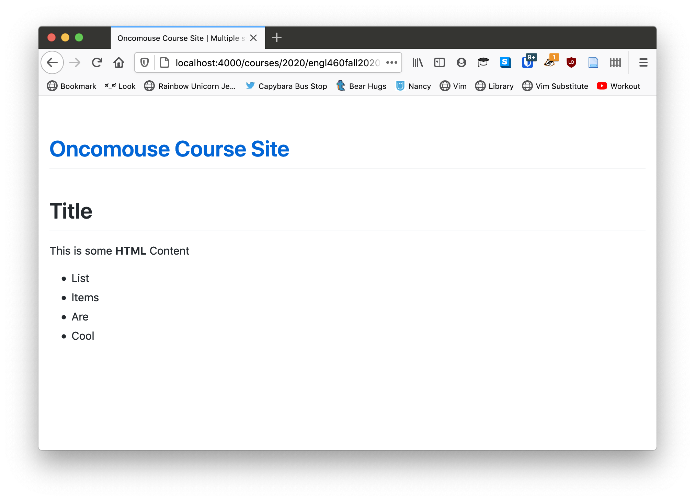

# Overview

Last week, we learned how to use plain text markup formats to create web content using HTML and Markdown. This week, we will take a small step back and discuss how markup languages also allow us to define "metadata" which is "data about data." This concept allows us to not only define content, as we have already done, but to describe that content in ways that are meaningful to both humans and machines.

In this chapter, we will learn:

1. Definition of metadata
1. How to define metadata in Jekyll
1. How to define metadata in HTML
1. Use-case for metadata: SEO

## Definition of Metadata

## Defining Metadata in Jekyll

We have already encountered metadata in Jekyll, which makes extensive use of the idea. Each of your posts, as well as the HTML files we have created, begin with a set of three dashes, like so:

~~~markdown
---
title: "New Post"
layout: post
---

Hey, blog!
~~~

The technical term for the content between the two sets of three hyphens is a "YAML metadata block," it lets Markdown documents contain information about the post that is not directly produced in the post itself. This is metadata.

Jekyll uses a convention that has developed around Markdown of including YAML information at the start of the document to describe more information about the contents. In the above post, we are setting the `layout` value for the page as well as the page's `title`.

### Important Note About Metadata in Jekyll

Any file not in a hidden folder (one that starts with `_`) that includes a YAML metadata block will be processed by Jekyll. Any files that do not contain metadata will be passed directly to output, unchanged.

This is important if, for some reason, you wanted to share a Markdown file on your site but you did not want it to become HTML. If we created the following file:

~~~markdown
# Title

This is some **Markdown** Content

* List
* Items
* Are
* Cool
~~~

When we [clicked on the link](/courses/2020/engl460fall2020/04-metadata-example1.md), our browser will try to download the file. This perhaps odd behavior is because GitHub Pages does not know what to do with the `.md` file we have asked it to give to us, so it offers it as a download. Odd, but expected.

Similarly, if we could create the following HTML page:

~~~html
<h1>Title</h1>

This is some <strong>HTML</strong> Content

<ul>
<li>List</li>
<li>Items</li>
<li>Are</li>
<li>Cool</li>
</ul>
~~~

If we [click that link](/courses/2020/engl460fall2020/04-metadata-example2.html), we see a very rough looking HTML page, but we do see HTML. This is because, while there is no metadata defining a layout, the file is still HTML, which GitHub Pages understands.

~~~html
---
---
<h1>Title</h1>

This is some <strong>HTML</strong> Content

<ul>
<li>List</li>
<li>Items</li>
<li>Are</li>
<li>Cool</li>
</ul>
~~~

If we [click that link](/courses/2020/engl460fall2020/04-metadata-example3.html), we see the same rough HTML page. Jekyll is aware of the site, but it provides no formatting. See [Setting Jekyll Defaults](#setting-jekyll-defaults) below for more information on how we might fix that.

### Another Metadata Example in Jekyll

On the [course blog](https://oncomouse.github.io/460blog), I use some more metadata to categorize your semester recap posts. Here's an example:

~~~markdown
--- 
title: "Recap Post"
author:
	name: oncomouse
	url: "https://oncomouse.github.io"
categories:
- recap
- fall2020
layout: post
---

Content of the recap post.
~~~

We have already encountered YAML before, but to refresh, 

## Site-wide Metadata for Jekyll

When we first created our blog, we created the `_config.yml` file. This file is known as the site-wide metadata file for our Jekyll site. Where metadata headers set information for a particular page, `_config.yml` sets metadata for the whole site. This is how we can set both a `title` key in `_config.yml` and in our individual blog posts.

### Setting Jekyll Defaults

When we made the third example file, the one with the empty YAML metadata block, in the previous example, the file still did not have a layout because of the empty metadata block. Thankfully, we can use our site-wide metadata to configure defaults that deal with just this situation.

The `defaults` key in `_config.yaml` sets default values for the site. It is a list of dictionaries that control defaults for different parts of the site.

To fix our earlier problem, we can add the following code in our [`_config.yml`](https://github.com/oncomouse/courses/blob/master/_config.yml):

~~~yaml
defaults:
  -
    scope:
	  path: ""
      type: "pages"
    values:
      layout: "default"
~~~

When we reload the third example, we see:

{:.text-center}

While, if we load the second example, we still see the same unstyled, rough HTML page. This difference occurs because, even without any metadata information in its YAML block, the third example page is "managed" by Jekyll. Once we define site-wide default values in `_config.yml`, the managed page acquires those default values. If we add values to the YAML block in example three, say changing `layout` to `post`, we "override" the default with the new settings. YAML blocks always override default values set in `_config.yml`.

### Setting a Default Layout for Blog Posts

Some of you have had problems with the `layout` on your blog, or are maybe getting sick of always having to remember to add `layout: post` (or `layout: default` depending on your theme). Using some YAML markup similar to what we saw above, you can add a default layout to blog posts.

Consider this:

~~~yaml
defaults:
  -
    scope:
	  path: ""
      type: "pages"
    values:
      layout: "default"
  -
    scope:
	  path: ""
	  type: "posts"
	values:
	  layout: "post"
~~~

We add a second value to the `defaults` list that has a different `scope` and a different `values`. Scope refers, in computing, to the applicability of a setting. In the first entry in `defaults`, we scope our settings to `"pages"`, which is any page we build. In the second entry, we scope the settings to `"posts"`. You can [read more about these and more settings in the Jekyll documentation](https://jekyllrb.com/docs/configuration/front-matter-defaults/).

## Defining Metadata in HTML

HTML also has the ability to define metadata. When we first learned about HTML, we talked about how an HTML document is first defined by `<html>` but then subdivided into `<head>` and `<body>` tags, such that we have an HTML document that looks like this:

~~~html
<!doctype html>
<html>
	<head>
	</head>
	<body>
	</body>
</html>
~~~

I added another tag there, the `<!doctype html>` tag. This is our first piece of metadata; it tells the browser that this is an HTML document, so that the browser does not have to guess we are giving it an HTML file. Then, we have our `<html>`, `<head>`, and `<body>` tags.

We have also already seen one HTML tag that supplies metadata: `<title>`:

~~~html
<!doctype html>
<html>
	<head>
		<title>Our Document</title>
	</head>
	<body>
	</body>
</html>
~~~

This tag tells the browser that the HTML document we are defining here is titled "Our Document." The `<title>` tag predates the understanding of metadata as important to HTML, so it is defined differently than most pieces of metadata.

For non-title metadata, we use the `<meta>` tag. So, if we wanted to add the author's name and a description to our page, we could type the following:

~~~html
<!doctype html>
<html>
	<head>
		<title>Our Document</title>
		<meta name="author" content="Andrew Pilsch">
		<meta name="description" content="An example page, showing how to define metadata in HTML">
	</head>
	<body>
	</body>
</html>
~~~

This shows the way the majority of `<meta>` tags will be defined, with `name` and `content` attributes. You can think about these as analogous to keys and values in the dictionaries we have been defining in YAML files.

## Other Important `<meta>` Tags

You can define any meta tag you want, but there are a few meta tags that are, if not outright required, *really* helpful to have in your document.

### 🚨Setting Character Encoding🚨

You can use meta tags to set the character encoding in your document. Remember when we talked about the strange history of plain text and how ASCII, the first character encoding set, didn't define characters used in non-English languages? And instead, a new standard, UTF-8, was defined? And this is how we got emoji?

In case you don't, UTF-8 is a format for storing plain text on your computer that allows you to store and display characters from non-English languages, such as accents (é), non-Latin alphabets (磨), emoji (🔥), or a variety of other fun characters.

If your webpage were not configured for UTF-8, none of those characters would display.

Unless you have a very compelling reason not to, **always** include `<meta charset="UTF-8">` somewhere in the `<head>` of your HTML documents.

### Make Sure It Looks Good On Your Cellphone

I'm going to break from my habit, in this text, of trying to explain *why* we do things in this section. Because this section teaches you something important for designing for the web in the 21st century, where lots of web traffic is on mobile phones, and because the explanation is not particularly interesting, I am going to just give you a rule:

To make sure websites display correctly on mobile phones, make sure you always have `<meta name="viewport" content="width=device-width, initial-scale=1">` in the `<head>` of your HTML document.

You may someday encounter a reason to change this tag, but you really need it for websites to work on your mobile phone.

### Keywords

To help make your site more discoverable by search engines, which we'll talk about more in ["Metadta for Search Engines"](#metadata-for-search-engines) below, you can use the `keywords` meta tag, though most search engines ignore them these days, because people try to game the search algorithm.

The `keywords` meta is a comma-separated list of words or phrases that describe your website. You can set it like this:

~~~html
<meta name="keywords" content="meta data, html, html meta data, using meta data, writing meta data">
~~~

This tag can help your site be better indexed on the larger web.

## Metadata for Search Engines

## Conclusion

