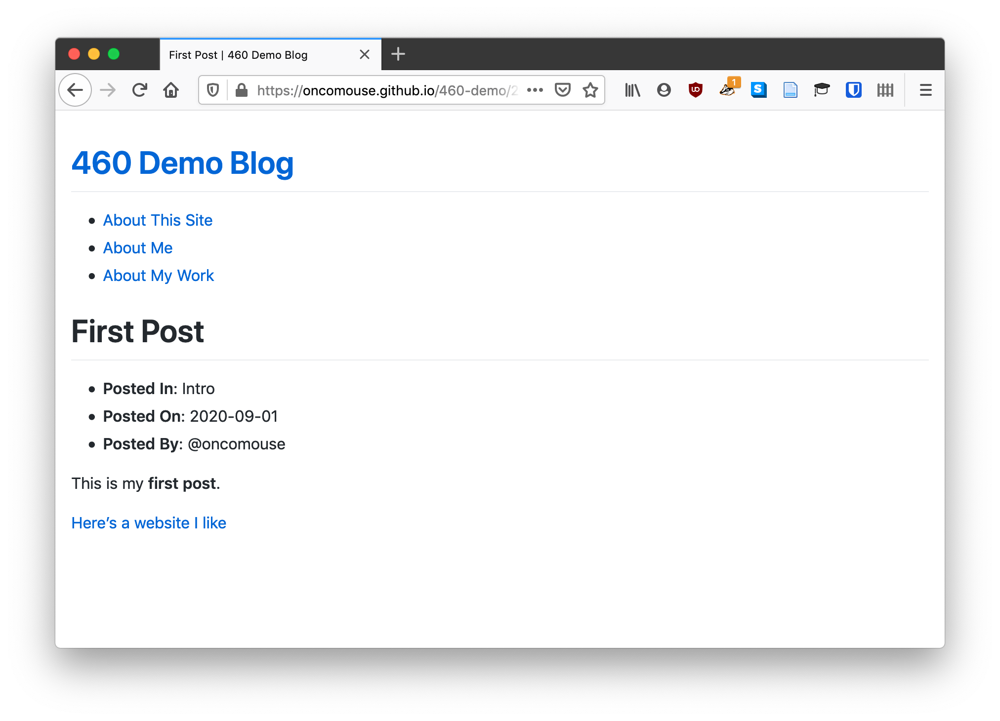
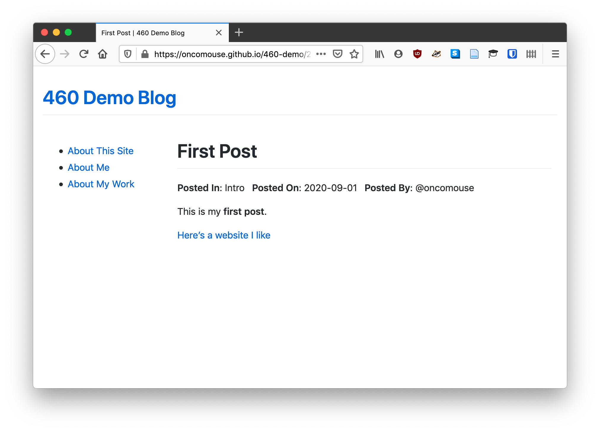

This week, we'll put our new-found knowledge of CSS to use.

So, if you're keeping up with the exercises, you probably have a site that looks something like this one:

{:.text-center}

So, we could make something like this:

# Styling Our Navigation Menu

# Styling Categories

# Your Challenge for the Week

