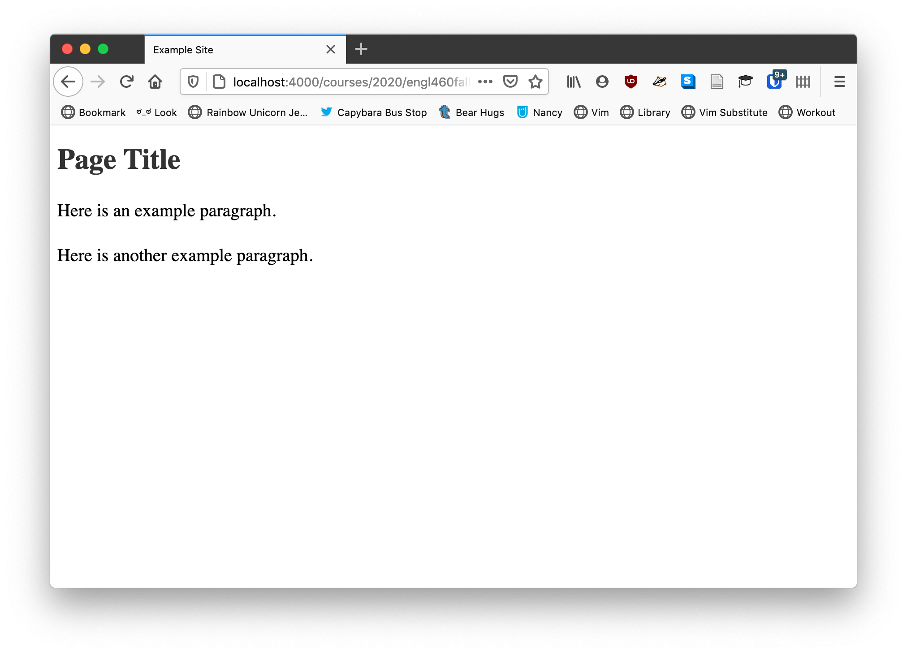

# Overview

We have seen a few examples ([here](./03-markup-example.html) and [here](./04-metadata-example2.html)) of HTML where things don't looks so fancy. But this chapter looks better than those examples. The content is neatly centered on the page, it's a font that isn't Times New Roman, there colors that aren't *the default blue*{:style="color:#00F; font-style: normal;"}. How is that possible?

The answer is through style.

HTML has evolved as an explicit semantic markup language that defines what content is, instead of how it is to be displayed. This is why we talk about *emphasis* and **strong emphasis** instead of italics and bold. To make this division clear, HTML files often rely on style information supplied by a separate stylesheet, written in a language called CSS (Cascading Style Sheets)

In this chapter, we will

1. Look briefly at how CSS works.
1. Learn how to apply CSS to HTML and Markdown documents.
1. Learn how to extend built-in styles in Jekyll.

**Important**: The entire CSS specification is huge and gives authors control over every aspect of a website's appearance. This chapter introduces the basic structures of CSS and how to use them. If you want to author your own CSS, you will need to do research into the language and learn some of the properties CSS can change.

# CSS: Describing Web Styles

CSS consists of a series of rules that control how elements on a page are displayed. Here's one now:

~~~css
p {
	font-size: 3em;
	color: red;
	margin-bottom: 4px;
}
~~~

The rule consists of two elements:

1. A **selector**
1. A **declaration block**

The selector is anything before the left pointing brace (`{`), in this case `p`. A declaration block follows a selector and is contained within braces (`{` and `}`). The selector tells your web browser to which elements on a page the rule applies. The declaration block contains the aspects of the matched elements to change.

Declaration blocks are further composed of **declarations**. A declaration contains a **property** and a **value**. The property is a string that cannot contain any spaces (words are separated by hyphens (`-`)) and are defined by the CSS specification. The value is separated by a colon (`:`) and can contain a variety of values, depending on the particular property.

To return to the above example, the selector tells the browser to match any paragraph tags (`
`) found in the document. The declaration block contains three declarations:

1. `font-size` -- change the size of the font (we set it to `3em`, which means "three times bigger than it would normally be" in CSS)
	* Numerical values in CSS have to have a unit attached (unless they are `0`)
	* For more on [CSS units, check out this tutorial](https://www.w3schools.com/css/css_units.asp)
1. `color` -- changes the color of the text, in this case to `red`.
	* For more on [CSS colors, check out this tutorial](https://www.w3schools.com/colors/default.asp)
1. `margin-bottom` -- changes the size of the bottom margin (which is the space between the edge of the element and its neighbor)
	* CSS margin and padding, which control the size of an element, are a bit tricky.
	* For more on this, [check out this tutorial on the CSS box model](https://www.w3schools.com/css/css_boxmodel.asp)

## Writing CSS Selectors

CSS has three ways of selecting elements:

1. By Tag
1. By Class
1. By ID

Tag here refers to the name of HTML tag, so selectors such as `a`, `p`, `h1`, etc., will select all tags that match the tag in question.

Classes and IDs are defined by the website's author and are used to identify tags. A class is a group of elements (either one tag or many tags) that the user wants to share some CSS styling. An ID is a unique identifier applied to one element, individually.

To use an analogy, classes in CSS are like families: many people belong to a particular family, though they may live in different places and have different jobs. IDs, though, are like social-security numbers in the United States, you are uniquely identified by your SSN. See ["Adding Style to HTML"](#adding-style-to-html) below for more information about how to use these.

**Class selectors** can be named anything you want (though, like everything in CSS, they cannot contain spaces). They are written starting with a dot (`.`) followed by the class name.

Considering the earlier example where we changed the paragraph styles, imagine we have reloaded our site with its new CSS and realized that making our paragraphs *red*{:style="color: #F00; font-style: normal;"} was a *terrible* idea. We still need some red paragraphs, though, so we can make a class, instead:

~~~css
.red-paragraphs {
	font-size: 3em;
	color: red;
	margin-bottom: 4px;
}
~~~

Now all our paragraphs won't have red text, but we can apply the class (which we'll learn how to do in a minute) to certain elements (not even just paragraphs).

**ID selectors** work the same way but apply to only one element. They can also be named anything you want, but are written with an octothorpe (`#`) followed by the ID name.

Here we define a single element that will have our red font stylings:

~~~css
#red-paragraph {
	font-size: 3em;
	color: red;
	margin-bottom: 4px;
}
~~~

**Important Information**: CSS was first published in 1996. Since that time, a series of best practices has developed around the standard, as happens with many standards. The general consensus in CSS development is that you should *only* use class selectors, avoiding ID and tag-based ones. Classes are the most versatile and do the best job of future-proofing your CSS code (in case you change the HTML).

# Adding Style to HTML

Now that we have seen a little about CSS, let's learn how to use it in our HTML documents!

## Adding CSS to your HTML files

"CSS is all great, Dr. Pilsch," you may be thinking, "but how do I use it?" And that's good question!

We have to define CSS somewhere in our HTML document in order to use it. CSS can be defined inside of an HTML file (which makes it in-line CSS) or in an external `.css` file. **The external method is greatly preferred** and should be used in the vast majority of situations.

CSS is **always** defined inside the document's `<head>` tag, as CSS is another example of metadata.

However, here is how to do both.

### In-line CSS

Consider a simple HTML document:

~~~html
<!doctype html>
<html>
	<head>
		<meta charset="UTF-8">
		<meta name="viewport" content="width=device-width, initial-scale=1">
		<title>Example Site</title>
	</head>
	<body>
		<h1>Page Title</h1>
		
Here is an example paragraph.

		
Here is another example paragraph.

	</body>
</html>
~~~

To include some in-line styles, we use the `
	</head>
	<body>
		<h1>Page Title</h1>
		
Here is an example paragraph.

		
Here is another example paragraph.

	</body>
</html>
~~~

That will change the color of the `<h1>` tag and the font size and line spacing of the `
` tags.

#### Why Not Use In-line Styles

If you use in-line styles, you have to include the same stylesheet on every page in your site. If you then change that style, you have to change every page on your site. You have to do this every single time you change something about your design. If you have hundreds of pages, that can be a real pain.

While Jekyll's templating system could mitigate this, HTML's existence as a semantic markup language also means that design and content *should* be separate. Storing CSS in the HTML document undercuts this. Further, and we won't talk about this in this chapter, when stylesheets are external, it is possible [to load different stylesheets in different scenarios, like when our user is making use of assistive technology such as a Braille reader or when the user is printing our site](https://www.smashingmagazine.com/2011/11/how-to-set-up-a-print-style-sheet/). Neither of these are possible with in-line stylesheets.

### External CSS Files

Ok, so we don't want to use in-line stylesheets. What can we do?

Stylesheets can also be stored in external files with a `.css` extension and then connected to the web page using a `<link>` tag.

The previous example would split into two files, a new CSS file we'll call `site.css`:

~~~css
p {
	font-size: 1.25em;
	line-height: 1.5;
}
h1 {
	color: #333;
}
~~~

And the HTML, which now contains a link to the CSS file:

~~~html
<!doctype html>
<html>
	<head>
		<meta charset="UTF-8">
		<meta name="viewport" content="width=device-width, initial-scale=1">
		<title>Example Site</title>
		<link rel="stylesheet" href="site.css">
	</head>
	<body>
		<h1>Page Title</h1>
		
Here is an example paragraph.

		
Here is another example paragraph.

	</body>
</html>
~~~

Now we have our site's CSS loaded in from an external file!

## Applying your CSS styles to HTML

But CSS can do more than just define rules for tags. We have classes and IDs in the specification, too.

To attach a CSS class to an HTML element, we use the `class` attribute. To attach an ID to an HTML element, we use the `id` attribute.

So, we could add the `text-center` class, which centers text, to a paragraph by writing `
Centered Text
`. We could name a header "title" by writing `<h1 id="title">`.

Using these two attributes, we can attach the rest of our CSS rules to our HTML.

### Generic HTML elements and style.

When we learned about Markdown, we talked about the difference between block and span elements (a paragraph or a list is a block in Markdown, while emphasis or a link is a span element). We also talked about this being applicable to HTML.

When we attach classes and IDs to elements, sometimes we don't want the associated semantic meaning in HTML. For instance, we may want to italicize the name of the author of a blog post on our site, but we don't want it to semantically mean "emphasized." In that case, we can use what is called a "generic HTML element."

There are two generic HTML elements, one for block elements and the other for span elements. The two tags are `
` for blocks and `` for spans.

In our example of the author's name, we may want to italicize the name of an author but not emphasize it. In that case, we may come up with some HTML that looks like this:

~~~html
<article>
	<header>
		<h1>Title of the Article</h1>
		<time>September 20, 2020</time>
		Andrew Pilsch
	</header>
</article>
~~~

Then we could generate the CSS:

~~~css
.author-name {
	font-style: italic;
}
~~~

From a visual, human-focused standpoint, this is a more complicated, but otherwise comparable, to just typing `<em>Andrew Pilsch</em>`. However, from the web browser's stand-point, it is not at all comparable, because `em` in HTML is meant to emphasize important information, while `span` does not have an implicit meaning. In this way, we can apply the italic styling without also implying a semantic meaning in the HTML. This is why generic tags are so important for designing the appearance of the website.

### Another Example of Generic Tags: Center Content

The basic site we built in the previous section looks like this when we display it in the browser:

{:.text-center}

We could make the site look a little better if we centered the column in the browser so that the text was a little narrower.

We have to use a `
` for that:

~~~html
<!doctype html>
<html>
	<head>
		<meta charset="UTF-8">
		<meta name="viewport" content="width=device-width, initial-scale=1">
		<title>Example Site</title>
		<link rel="stylesheet" href="site.css">
	</head>
	<body>
		

			<h1>Page Title</h1>
			
When we learned about Markdown, we talked about the difference between block and span elements (a paragraph or a list is a block in Markdown, while emphasis or a link is a span element). We also talked about this being applicable to HTML.

			
When we attach classes and IDs to elements, sometimes we don’t want the associated semantic meaning in HTML. For instance, we may want to italicize the name of the author of a blog post on our site, but we don’t want it to semantically mean “emphasized.” In that case, we can use what is called a “generic HTML element.”

		

	</body>
</html>
~~~

And add to the CSS:

~~~css
.container {
	margin: auto;
	max-width: 960px;
	width: 100%;
}
~~~

We get [a nicely centered column of text](./05-style-example1.html).

The code to center a block is, counter-intuitively, `margin: auto`. Why? Because CSS is just like that some times. We also set a width and a max-width because it will make sure the column grows with the size of the user's screen (say if they were on a cellphone) until it hits our [desired max of 960px](https://stackoverflow.com/a/7415984).

We can also use generic tags to format and define regions of our website!

# Compound CSS

But can we only apply CSS to single kinds of elements, classes, or IDs? Thanksfully, not. We can make nested selectors and we can combine selectors to make more complex and useful rules.

## Nesting Selectors

HTML, as you remember, is a hierarchical markup language, with children elements contained within parent elements. CSS can write selectors to take advantage of this structure.

Sometimes you may need to target a particular element inside of another. For instance, say you were adding the class `phone-numbers` to some `<ul>` tags in your document. You need to do some formatting on the `li` tags in each list. In CSS, you can write a nested selector, which combines two selectors in sequence. We could write:

~~~css
.phone-numbers li {
	font-weight: bold;
}
~~~

Now all the `li` in our phone number lists are going to be bold. You can read this selector from right to left as "target all list items contained within an element with the class `phone-numbers`." The space establishes a parent child relationship in CSS.

### Note on Parentage

In CSS, and this can be very frustrating to remember, the parent child relationship is not immediate in nested selectors, so the above CSS selector would match all the `<li>` tags below:

~~~html

	

		<ul>
			<li>123-456-7890</li>
			<li>123-456-7890</li>
			<li>123-456-7890</li>
			<li>123-456-7890
				<ul>
					<li>123-456-7890</li>
					<li>123-456-7890</li>
					<li>123-456-7890</li>
					<li>123-456-7890</li>
				</ul>
			</li>
		</ul>
	

	

		<ul>
			<li>979-867-5309</li>
			<li>979-867-5309</li>
			<li>979-867-5309</li>
			<li>979-867-5309</li>
		</ul>
	

~~~

Even though none of the above `li` tags are direct children of the element with the `phone-numbers` class, they are all children in CSS's eyes.

### Direct Parent -> Child Relationships

In CSS, to select only direct children of a particular parent, you can separate the two rules with a less than symbol (`>`). So, `.phone-numbers > li` will only select `li` tags that are the direct children of a `.phone-numbers` class.

~~~html
<ul class="phone-numbers">
	<li>I will be styled</li>
	<li>I will be styled
		<ul>
			<li>I will not be styled</li>
		</ul>
	</li>
</ul>
~~~

In the above examples, only the elements that contain "I will be styled" are targeted by `.phone-numbers > li`.

## Combining Selectors

Rules can also be combined outside of nesting. The most common usage for this is applying styling to all six levels of headings in HTML. To do that, rules are separated by commas (`,`). For instance to change headings from bold to normal weight, we could use the following CSS rule:

~~~css
h1,
h2,
h3,
h4,
h5,
h6 {
	font-weight: normal;
}
~~~

This lets us combine selectors quickly and efficiently.

**Note on Styling Styles:** Many CSS style guides suggest placing a linebreak after a column to better emphasize each selector in a combined selector, but it is not required by the specification. It is merely done for readability.

# Applying Style in Jekyll Markdown

# Creating New Styles

## Using Developer Tools to Edit CSS Live
