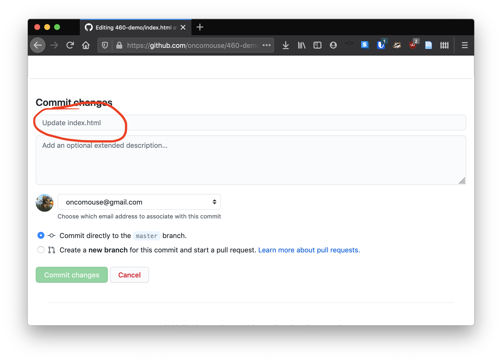

Since we are at midterm and we will be moving into looking at some other examples of digital writing over the next two weeks, it seems a good time to reflect on what we have learned and cover a few lingering topics related to Jekyll. This week, we will discuss more about Jekyll and GitHub.

# How Does Jekyll Work?

# What Actually is GitHub?

So far we have been using GitHub for it's Pages support as a blogging engine. We could have used something like [Wordpress](https://wordpress.com/) to accomplish this, but we didn't. This section discusses a bit more about why we use GitHub Pages and how we can use the full power of GitHub to better manage our workflow.

## Building a Better History

GitHub is designed as a repository for any software project, not just a blog like we are writing. The website is based around a tool called `git` which was originally developed to manage the core of the Linux operating system. Most open source software projects use GitHub (or the site's main competitor, GitLab) to track and coordinate the development of software.

The core of git's operation is in something called a "commit." Commits are incremental changes to the repository that are bundled together to track the addition of specific changes. If commits sound scary, remember that every time you update your blog, the button you press on GitHub is labelled as "Commit to Repository." By editing your site, you have already been building a history of commits to your blog.

From the main page of your repository, in the upper right hand of the blue title bar above your repository's list of files, there is an icon like a backwards running clock next to a number. Clicking this will show your repository's commit history. Here's an example:

{:.text-center}

The history list contains all your commits, including the description of the commit, the author of the commit, and when it was made. To the right of this is three buttons. The second button contains a seven digit [hexadecimal](https://simple.wikipedia.org/wiki/Hexadecimal) number. Clicking this will show you the changes made in that commit in the form of a [diff](https://en.wikipedia.org/wiki/Diff). The red text on the left of the diff is text that was deleted, while the right column of green text represents additions. A diff is a compressed plain-text format for viewing changes made to a repository over time.

Back on the history page, the third button next to each commit description contains a pair of less than (`<`) and greater than (`>`) symbols. Clicking this button will let you browse the repository as it was at the time of the commit.

Between these two buttons and your commit history, you can explore changes you've made, which can be especially useful if something has broken on your site.

### But, Dr. Pilsch, My Commits are all Named "Update default.html"

Using GitHub to edit your blog, you probably have not been filling out the title bar above the code when you change it, leaving "Update \<file name\>" as the default. This has been an easy editing workflow and has served you well in the past (when I'm editing my GitHub repositories on my phone, I don't bother with that box either). However, now that we have discovered the commit history, we might wish we had been setting something in that field.

{:.text-center}

In GitHub's terminology, the contents of this box is called a "commit message" and it is used, as we have already seen, to let others (or a future version of ourselves) know what was changed in a particular commit.

Going forward, it is probably a good idea to set a commit message. There is a recommended 50 character limit on the commit message. If you need to add more information than those 50 characters, you can add them in the "Add an optional extended description..." field below the initial commit message. This recommendation developed out of some early work on git commit messages by [a developer named Tim Pope](https://tbaggery.com/2008/04/19/a-note-about-git-commit-messages.html).

## I'd Like to Stop Breaking My Site, Please

*Talk about branches*

### Pointing GitHub Pages At Your Branch

### Creating a Pull Request With Your Changes

# Can I Have a Better Editor?
