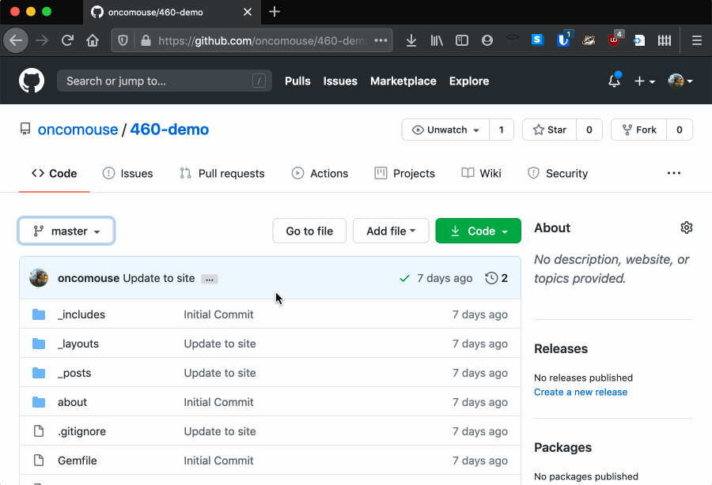
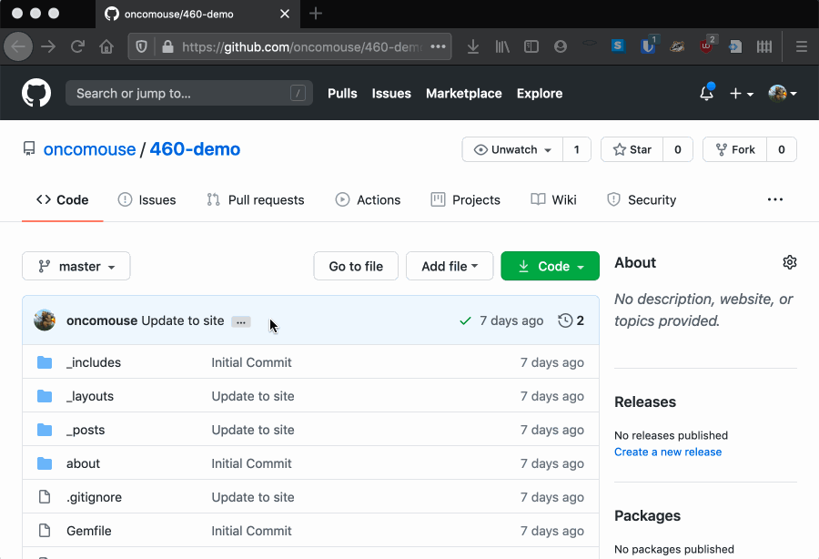
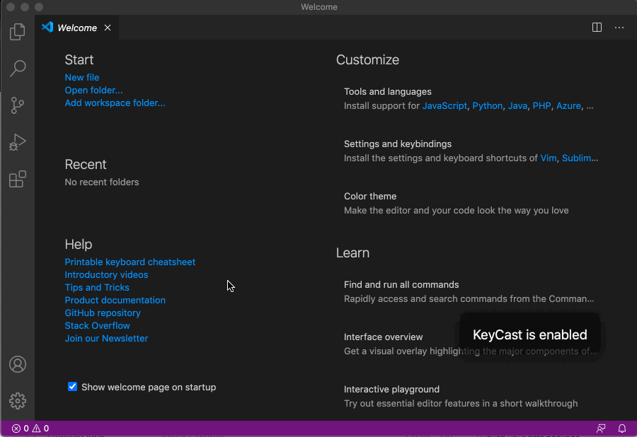
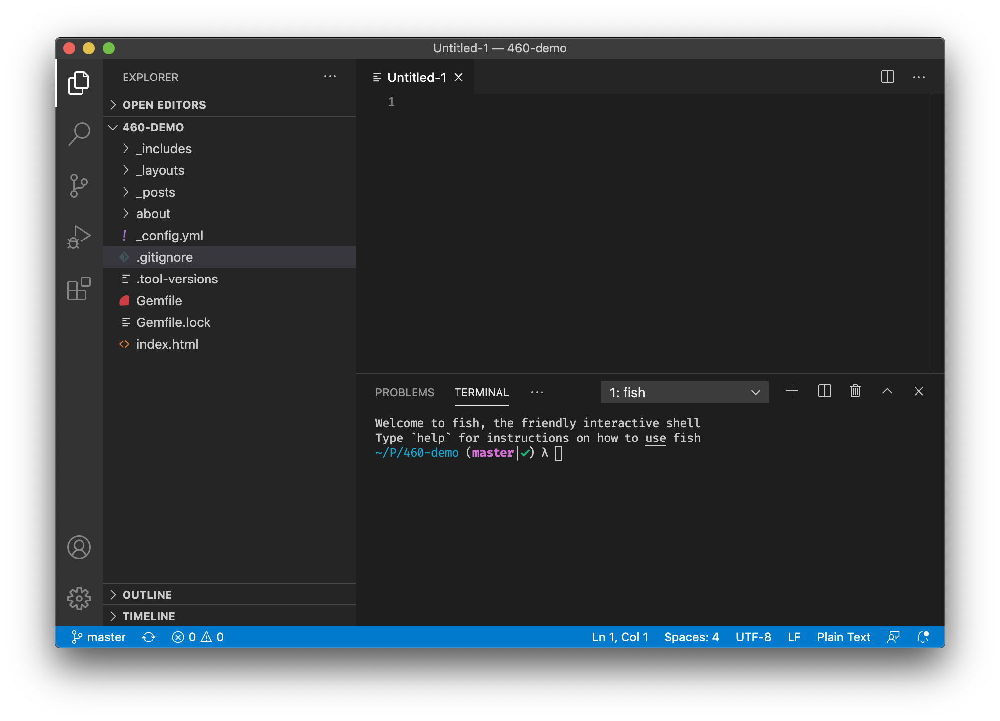
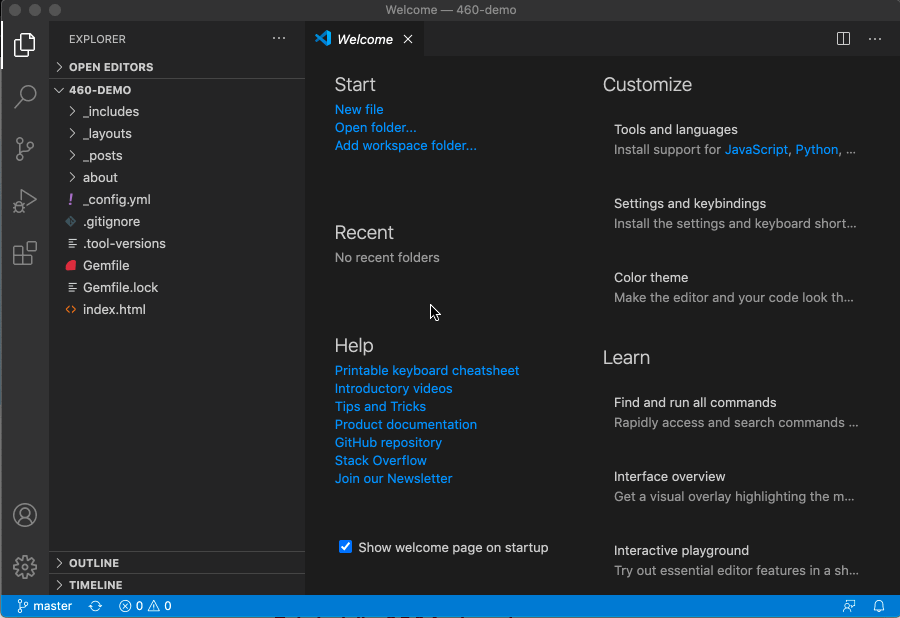
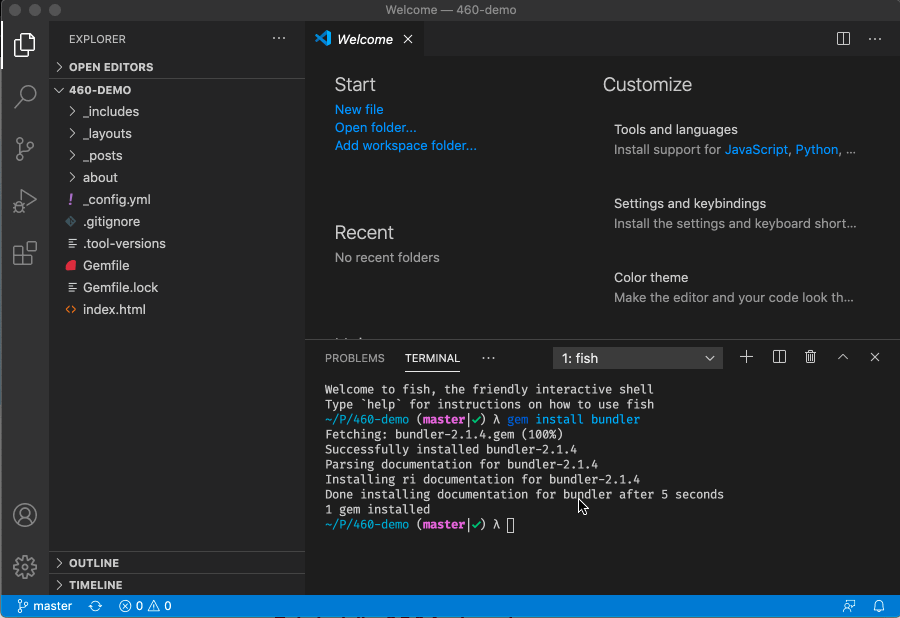

Since we are at midterm and we will be moving into looking at some other examples of digital writing over the next two weeks, it seems a good time to reflect on what we have learned and cover a few lingering topics related to Jekyll. This week, we will discuss more about Jekyll and GitHub.

# How Does Jekyll Work?

# What Actually is GitHub?

So far we have been using GitHub for it's Pages support as a blogging engine. We could have used something like [Wordpress](https://wordpress.com/) to accomplish this, but we didn't. This section discusses a bit more about why we use GitHub Pages and how we can use the full power of GitHub to better manage our workflow.

## Building a Better History

GitHub is designed as a repository for any software project, not just a blog like we are writing. The website is based around a tool called `git` which was originally developed to manage the core of the Linux operating system. Most open source software projects use GitHub (or the site's main competitor, GitLab) to track and coordinate the development of software.

The core of git's operation is in something called a "commit." Commits are incremental changes to the repository that are bundled together to track the addition of specific changes. If commits sound scary, remember that every time you update your blog, the button you press on GitHub is labelled as "Commit to Repository." By editing your site, you have already been building a history of commits to your blog.

From the main page of your repository, in the upper right hand of the blue title bar above your repository's list of files, there is an icon like a backwards running clock next to a number. Clicking this will show your repository's commit history. Here's an example:

{:.text-center}

The history list contains all your commits, including the description of the commit, the author of the commit, and when it was made. To the right of this is three buttons. The second button contains a seven digit [hexadecimal](https://simple.wikipedia.org/wiki/Hexadecimal) number. Clicking this will show you the changes made in that commit in the form of a [diff](https://en.wikipedia.org/wiki/Diff). The red text on the left of the diff is text that was deleted, while the right column of green text represents additions. A diff is a compressed plain-text format for viewing changes made to a repository over time.

Back on the history page, the third button next to each commit description contains a pair of less than (`<`) and greater than (`>`) symbols. Clicking this button will let you browse the repository as it was at the time of the commit.

Between these two buttons and your commit history, you can explore changes you've made, which can be especially useful if something has broken on your site.

### But, Dr. Pilsch, My Commits are all Named "Update default.html"

Using GitHub to edit your blog, you probably have not been filling out the title bar above the code when you change it, leaving "Update \<file name\>" as the default. This has been an easy editing workflow and has served you well in the past (when I'm editing my GitHub repositories on my phone, I don't bother with that box either). However, now that we have discovered the commit history, we might wish we had been setting something in that field.

{:.text-center}

In GitHub's terminology, the contents of this box is called a "commit message" and it is used, as we have already seen, to let others (or a future version of ourselves) know what was changed in a particular commit.

Going forward, it is probably a good idea to set a commit message. There is a recommended 50 character limit on the commit message. If you need to add more information than those 50 characters, you can add them in the "Add an optional extended description..." field below the initial commit message. This recommendation developed out of some early work on git commit messages by [a developer named Tim Pope](https://tbaggery.com/2008/04/19/a-note-about-git-commit-messages.html).

## I'd Like to Stop Breaking My Site, Please

In addition to managing the commit history with tracked changes to our repository, GitHub also allows for the creation of what are called branches. A branch is a parallel stream of commits that branches (hence the name) off of the main branch, called "master" in GitHub. Branches are used to experiment with new features and to track the development of projects that are not quite ready for prime time but are interesting, nonetheless.

Branches are especially useful for our purposes, because they can let us implement new features without breaking our working site and disrupting our commit history with lots of false starts and incorrect attempts.

To create a branch on GitHub, find the pull down menu that says "master," which is located on the left side of the repository just above your files and folders. In the pull down menu, you'll find a field labelled "Find or create a branch..." Type the name of the branch in this field. If you entered a new branch name, the option to "Create branch: XXX from master" will appear. Click on that option and a new branch will be created.

{:.text-center}

You can name branches whatever you want, but it is generally a good idea to name them after the feature you are trying to implement. You can create as many branches as you want on GitHub, so feel free to create new ones when you want to implement new features.

You can now edit your site as you see fit in this branch without changing the master branch. But two things remain: how do we see the results of our changes? And how do we get the changes back to the master branch?

### Pointing GitHub Pages At Your Branch

When working on your blog in a different branch, you can set GitHub Pages to display the contents of that branch. To do so, click on "Settings" in your repository and scroll down to the "GitHub Pages" section. Under the heading "Source," there is a drop down menu that is set to "master." Click on the name of the branch and press the "Save" button. Your page will reboot and you will be able to see changes on the new branch.

Just remember to set your GitHub Pages source back to master when you are done working in your branch!

{:.text-center}

### Creating a Pull Request With Your Changes

As you edit files on your new branch, eventually you will want to get changes back to your master branch. There is a process for doing this on GitHub's website, utilizing GitHub's pull request feature. A pull request is a way to suggest changes to a repository that you don't own or to have new changes reviewed when you are working as part of an organization. It is also how we can add changes from our branch.

Once you have committed the changes you want to add to master, in your repository, click on the "Pull Request" tab. Click on the green button for "New Pull Request." You will see two drop down menus (one labelled "base:" and one labelled "compare:"). "Base" is the branch we will be adding changes to, while "compare" is the branch we will source changes from. We keep base as master for this exercise, and need to select our updated branch in the compare drop down.

This will load a list of commits, along with their diffs, we can then click the green "Create Pull Request" button. There will be a form where we can title our PR, as well as provide an explanation of the changes we are requesting to make (this is more important when you are pulling on someone else's project or using GitHub as part of a team). Then we click "Create Pull Request."

When the PR is created, we can click on our repo's "Pull Request" tab again, click on the PR we just created and scroll to the bottom. There will be a green button that says "Merge pull request" and a message telling us there are no conflicts (if there were conflicts, we could fix them there). Click the green "Merge pull request" button and your changes will be in master.

{:.text-center}

#### Remote Forks and Pull Requests

Pull requests may seem like an obscure and strange mechanism, but they are crucial to the way GitHub works as part of a modern digital workflow. They are so important because, in addition to branching a repository internally to create new changes, GitHub has another mechanism, called "fork," that lets you make a copy of someone else's repository, make your own changes to it, and then issue a pull request from your repository to theirs. I've used this mechanism to help a few of you who have gotten stuck this semester, for instance.

In the upper right of the repository, just below the black menu bar, is three buttons: watch, star, and fork. These tell social statistics for the GitHub repository. "Watch" is like following a page on Facebook or an account on Instagram or Twitter: it tells GitHub you want to receive notices when this repository changes. "Star" is like liking a post on any other social media site: it is saying "I like this repository." "Fork" is a way of interacting with a repository unique to GitHub.

When you fork a repository, you are creating a new repository that you own, based on someone else's code. If the original owner changes their repository, it doesn't effect your fork (unless you tell your code to accept the changes); if you change your forked repository, it doesn't effect the original repository. Forks are used to make long-term, complicated, versioned changes to projects you don't own.

When you have changed a fork and have it working, you can go through the process of creating a new pull request, but, because it is a fork, GitHub will automatically make the original repository the "base" branch and your fork's master the "compare" branch. This lets you issue a PR from a fork to the original and can let owners of a project add new features without giving access to their repository to others. It lets GitHub work as a de-centered version tracking network.

### Deleting Old Branches

You may delete a branch when you are finished working with it. To do so, once again select the branch drop down menu we used to create the branch. At the bottom, is a link to "View all branches." Click that and on the resulting page, clicking on the red trash can will delete a branch. You can also restore accidentally deleted branches from this page.

# Can I Have a Better Editor?

*Note of Warning*: This section discusses the most challenging things we will be doing with a computer this semester. It will greatly improve your workflow when interacting with GitHub, but it is challenging. Please read over this material, but I recognize that these topics are often a bit more complex than the stuff we have been doing, so if you don't feel like you want to improve on your workflow for the semester, that's fine. Though you do need to be aware of this material.

Ok, so let's be real: editing files in the GitHub web text editor is not great. Waiting to see if the site will load correctly while GitHub Pages rebuilds? Also not the greatest.

Can we do better?

Yes, but it is going to take some work on our part.

Jekyll, the blogging engine used by GitHub Pages, is a computer program written in a language called Ruby. You can use Jekyll without using GitHub Pages. It is designed to run locally on your computer.

Additionally, the true power of GitHub lies in a yet third mechanism beyond forking and branching: cloning. Cloning creates a copy of a repository on your computer. If you clone a repository you own, you continue to be the owner of it. If you clone a repository owned by someone else, they continue to own it but you can edit the local copy.

Cloning a repository is how we interact with our website without having to use the often clunky interface of GitHub (side note, if you get serious about working with plain text, you should try to *always* avoid writing in a web browser, which is why we are not learning Wordpress this semester). For software managed over GitHub, cloning can be how we use someone else's code while tracking changes (for instance, [my preferred text editor](https://neovim.org) uses GitHub to track plugins and clones repositories to get updates as plugins change). Cloning is the most common way you will interact with GitHub, if you use it outside this class.

Understanding that Jekyll is a program we can run without GitHub Pages and that cloning lets use create a local copy of a remote repository, hopefully you can see what we are going to be doing in this section: downloading our repository and running a local copy of a Jekyll web server so we can see changes to our site instantaneously.

We have to do three things to do this:

1. Install a text editor that supports GitHub
1. Install Jekyll on our computers

## Visual Studio Code - A Modern Text Editor

We are finally going to get around to working with a real, industrial-strength text editor. The one I recommend to people getting interested in plain text in 2020 is [Visual Studio Code](https://code.visualstudio.com/). To get started using it, click that link, download the editor, and install it on your computer. When you open it, you will see the following:

{:.text-center}

### Cloning a Repository in Visual Studio Code

We can use VSCode to clone our GitHub repository, so let's see how to do that now.

A core mechanism in VSCode is the command palette, which lets you search for the *many* commands offered by the editor. On Windows, the command palette is accessed by hitting <kbd>Ctrl+P</kbd>. On macOS, it is accessed with <kbd>Command+P</kbd>.

We can use the command palette to search for the "Git: Clone" command, so if we open the command palette and search for "git clone," we should see the command. Highlight it and press <kbd>enter</kbd>. A dialog will pop up asking for the URL to clone from. Copy and paste your GitHub repository's URL (copy the text in the browser's location field when you are visiting your repository) into this dialog and press <kbd>enter</kbd>.

VSCode will now ask you for a location to clone into. You can save your repositories anywhere you wish, but by convention, GitHub clones live in a folder called `Projects`. So, I select my `Projects` directory and VSCode clones my repository. In the bottom right of the screen, VSCode will show a notification when it is finished and ask if I'd like to Open my cloned repository. Doing so, I see the contents of my repository.

{:.text-center}

### Using Visual Studio Code

To the left of the VSCode window, you find the "Explorer." This pane represents all the files in a particular project, in this case your blog. On the right, when you click on a file, you will see its contents. This content pane is tabbed, so you can have multiple files open at the same time. 

For languages understood by VSCode (such as HTML), the editor will attempt to guess the tag or property you are typing, while you are typing. You can use <kbd>tab</kbd> and <kdb>shift+tab</kbd> to navigate this menu.

As you may have noticed already, VSCode uses a lot of keyboard shortcuts to make common tasks easier to perform. There are *many* shortcuts in VSCode. Microsoft provides a cheat sheet listing keyboard shortcuts for [Windows](https://code.visualstudio.com/shortcuts/keyboard-shortcuts-windows.pdf) and [macOS](https://code.visualstudio.com/shortcuts/keyboard-shortcuts-macos.pdf), if you would like to learn how to maximize the capabilities of this editor. Keyboard shortcuts are one of the main ways text editors help digital authors do more quickly.

### Pushing and Pulling: Working with a Cloned Repository

Now that we have a local copy of our repository, we can change it as much as we want. But what happens when we finally have things working and we want to see those changes on our GitHub Pages blog?

To do this, we have to perform an action on GitHub called a "push." Pushing is how we move changes from a clone to its remote master when we already own the repository. It's a more convenient way to update a repository than creating a pull request, but it is only available between a clone and a remote master that we own.

Pushing a change is a three step process. We have to first stage changes, then we have to commit them to the local repository, then we push that commit to the remote repository. The first two steps, staging and committing, were taken care of for us on GitHub's webpage. Doing them locally with VSCode, however, lets us bundle changes into chunks, if we like, and allow us more control over the shape of our repository's commit history.

When we change files in VSCode, a button on the left side of the screen will start a count that goes up each time we change a new file. This button, which is below the icon that looks like a magnifying glass, opens the "Source Control" pane, which tracks local changes to our code. If we click on it, we see our changes divided into staged and unstaged changes. Staging marks a change as ready for publication in git. In the list of changes, clicking the "+" next to each file name will add the change to the staged changes. Clicking the "-" next to the file name of a staged change will unstage it. You can also press the backwards circling arrow to the left of the "+" to discard changes, if you changed something that did not work.

Above this list of changes, is a field labelled "Message." We can type our commit message here. Then we press <kbd>Ctrl+Enter</kbd> on Windows or <kdb>Command+Enter</kbd> on macOS to commit our change. When that happens, we have updated our local repository. Moreover, GitHub now knows that our local repository is one commit (or more) ahead of the remote master repository. To fix this, we can issue a "Push." In the "Source Control" pane, above the commit message field, clicking on the "..." button will bring up a menu that contains a submenu labelled "Push/Pull." From this sub-menu, we can click "Sync," which will push our changes out to our remote repository.

Sync performs an additional task: if others are working on the same repository as us (or if you make changes in your web browser directly on the remote master; or edit a different clone on a different computer), our current local repository will become "behind" the remote master. In GitHub, we "pull" these remote changes down to our local repository, in order to catch up to the master. In VSCode, pushing and pulling is squashed into one function called sync, so you can just use that menu option. You can also run "Git: Sync" from the command palette (<kbd>Ctrl+P</kbd> on Windows; <kbd>Command+P</kbd> on macOS).

{:.text-center}

*Note:* You can also click in the "Synchronize Changes" panel in the bottom menu to sync changes, as I do in the GIF. That panel will also show you how many commits ahead and behind of the remote master your repo is.

## Getting Jekyll Working Locally

Now that we can edit locally and push our changes back to our repository, it would be nice to see what our changes looked like without having to wait for GitHub Pages to rebuild. Thankfully, we can do this pretty simply using VSCode.

First, if you are on a Windows machine, you will need to install the Ruby programming language on your computer to use Jekyll locally. You can [download it here](https://rubyinstaller.org/); it is pretty straight-forward to install. I broke my last working Windows machine, so I can't demo this portion of the course, but if you are having problems with it, I can help in office hours.

If you are using macOS, you're in luck, your computer already has a version of Ruby installed.

Ruby uses a command line interface to work. The command line is an old form of interacting with a computers, before the invention of the graphical user interface (GUI) at Xerox PARC in the 1970s and the popularization of the paradigm by Apple with the Macintosh. In a lot of ways the command line is a more powerful way to interact with a computer (I'm typing this chapter in a command line editor, for instance) but it can be challenging if you've never used it before.

Thankfully, VSCode builds in a terminal to the editor.

Once you, if you are using Windows, have installed Ruby, open your cloned repository in VSCode. We have to add two files to our repository and commit them, for this to work, so let's do that first.

### New Files

First, create a new file (<kbd>Ctrl+N</kbd> on Windows; <kbd>Command+N</kbd> on macOS) and add the following to it:

~~~ruby
# frozen_string_literal: true

source 'https://rubygems.org'
# Hello! This is where you manage which Jekyll version is used to run.
# When you want to use a different version, change it below, save the
# file and run `bundle install`. Run Jekyll with `bundle exec`, like so:
#
#     bundle exec jekyll serve
#
# This will help ensure the proper Jekyll version is running.
# Happy Jekylling!
gem 'jekyll', '~> 3.8'
group :jekyll_plugins do
  gem 'github-pages'
end

# Windows and JRuby does not include zoneinfo files, so bundle the tzinfo-data gem
# and associated library.
platforms :mingw, :x64_mingw, :mswin, :jruby do
  gem 'tzinfo', '~> 1.2'
  gem 'tzinfo-data'
end

# Performance-booster for watching directories on Windows
gem 'wdm', '~> 0.1.1', platforms: %i[mingw x64_mingw mswin]
~~~

We are telling Ruby to install some libraries for us so we can use Jekyll. Save this file as `Gemfile` (not the capital "G").

Create another new file and add the following:

~~~
_site/
.sass-cache/
.jekyll-cache/
.jekyll-metadata
~~~

Save this file as `.gitignore` (note that the file starts with a period). This file tells git to ignore some of the files created by Jekyll when it runs locally. We don't want to commit these to our repository, as they will be generated differently, depending on which computer we are working on.

Once you have saved these two files, you can commit them to your repo and push them to your remote master.

### Installing Jekyll

Now, we are going to use the command line. Command lines work by taking a series of words as programs and arguments to those programs. You type in your command and press <kbd>Enter</kbd> to execute the code. Everything has to be spelled correctly, capitalized correctly, and spaced accordingly. It takes a while to get used to this mode of working. Make sure you copy or transcribe the commands I provide *exactly*.

To open a command line in VS Code, you can press <kbd>Ctrl+~</kbd> on Windows or <kbd>Control+~</kbd> on macOS (note that this command on macOS does not use the command key!). This will bring up a command line window in the lower third of your right pane. There is an illustration of one below, though yours will look different than mine, as I have customized my command line quite a bit:

{:.text-center}

In my terminal window, there is a small white square after a lamdba symbol (λ). The white square is called the cursor, it is the current position where typed text will enter. If you do not see a cursor, the command line is still running a program and you cannot enter text yet. Some command line programs take a while to execute (we are going to execute one in particular). Also, once we start Jekyll on our computer, the program will run until will tell it to stop.

Now, to start the process of getting Jekyll working, we need to enter a few commands. First, we need to install a program called bundler, which downloads other required pieces of software. To do so, run `gem install bundler` from the command line you opened in your repository.

{:.text-center}

Next, we need to use bundler to install the rest of the Jekyll requirements. To do so, run `bundle install` from the command line you opened in your repository.

{:.text-center}

Now, we have a working installation of Jekyll!

