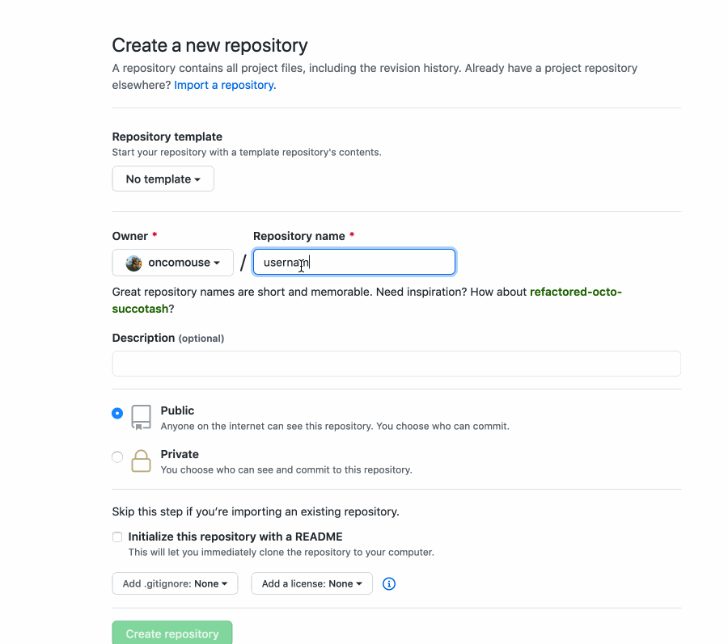
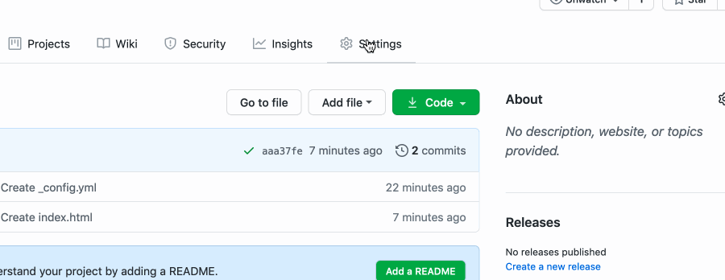
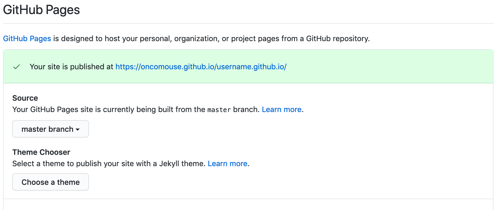
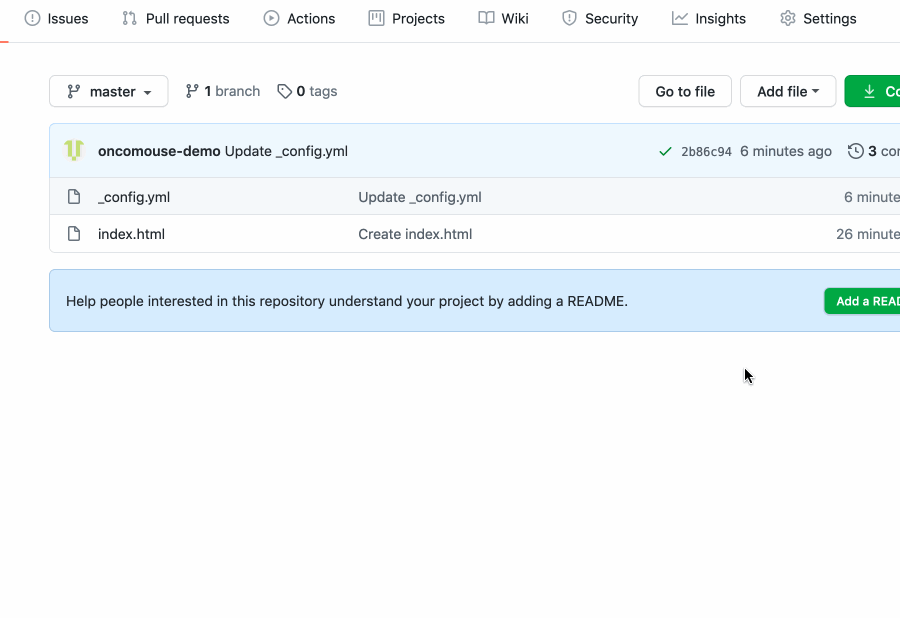

[Back to Syllabus](./)

# Getting Started

This document will teach you how to create a basic blog using Jekyll and GitHub Pages

## Before You Begin

1. You will need a GitHub account for this tutorial
	* Don't have one yet? [Click here](https://github.com/join?ref_cta=Sign+up&ref_loc=header+logged+out&ref_page=%2F&source=header-home)
	* You might also think about signing up for the [Student Developer Pack](https://education.github.com/pack)

## Creating Your Site

GitHub uses the concept of a **repository** to organize projects. GitHub "repos" have a lot of features not covered in this tutorial, but we will be creating our first repository for this project.

Visit [http://github.com/new ](http://github.com/new) to create a new repo. When there, you will need to call your new repository "\<username>.github.io", **where you replace \<username> with your GitHub username**. If your GitHub username was `just_an_aggie`, you would type "just_an_aggie.github.io" as your repository name. If your GitHub username was `some_student`, you would type "some_student.github.io" as your repository name.

<figure>

<figcaption>Creating a new repository on GitHub. Note: I enter "username.github.io" because my <a href="https://github.com/oncomouse/oncomouse.github.io"><code>oncomouse.github.io</code> repository</a> already exists.</figcaption>
</figure>

## Adding Initial Content

We have to create a few files before we can get started blogging:

### Creating `_config.yml`

To create your first file, go to your repository (this is the page you should be on if you just created your repository).

Under the heading "Quick setup — if you’ve done this kind of thing before," there is a link called for "creating a new file". Click on that.

On the resulting page, in the box captioned "Name your file," type `_config.yml` (make to include the underscore at the start of the filename).

Copy and paste the following code block into the file editor (to the right of the number 1 and below "Edit new file").

~~~yaml
#
# This file contains configuration flags to customize your site
#
# Name of your site (displayed in the header)
title: Site Title
# Short bio or description (displayed in the header)
description: A Blog

#
# !! DON'T EDIT BELOW THIS MESSAGE
#
# Use the following plug-ins
plugins:
  - jekyll-sitemap # Create a sitemap using the official Jekyll sitemap gem
  - jekyll-feed # Create an Atom feed using the official Jekyll feed gem

# Exclude these files from your production _site
exclude:
  - Gemfile
  - Gemfile.lock
  - LICENSE
  - README.md
  - CNAME
~~~

In the editor, where the file says `title: Site Title`, you can change "Site Title" to whatever you want your blog to be called. You can also edit `description: A Blog` to better describe your site. YAML is the file format used to configure your blog. [Check out this tutorial](https://rollout.io/blog/yaml-tutorial-everything-you-need-get-started/) if you would like to learn more.

When you are done editing your file, scroll to the bottom of the page and click "Commit new file" to save your changes. "Commiting" is the fancy GitHub lingo for saving files to your repo.

<figure>

<figcaption>Creating a new <code>_config.yml</code> file.</figcaption>
</figure>

### Creating `index.html`

Having created our first file, we need to create one more before we can start blogging. It's going to be called `index.html`. You can think of it as the front page of your new blog.

If you have learned HTML, the code we are copying may look a little strange. [Jekyll](https://jekyllrb.com/), the blogging software used by GitHub Pages, uses some special code to turn our posts into HTML.

If you haven't learned HTML yet, this all will probably look like a foreign language. But that's ok, we'll talk more about what all this does.

So on your repo, click on the "Add file" menu and select "Create new file" from the drop-down menu.

In the "Name your file" box, type "index.html". In the file editor, paste the following code block:


~~~html
---
layout: default
---

  
    <article class="post">

      <h1><a href="{{ site.baseurl }}{{ post.url }}">{{ post.title }}</a></h1>

      

        {{ post.excerpt }}
      

      <a href="{{ site.baseurl }}{{ post.url }}" class="read-more">Read More</a>
    </article>
  

~~~


Scroll to the bottom and click "Commit New File" to commit `index.html` to your repo.

<figure>

<figcaption>Creating a new <code>index.html</code> file.</figcaption>
</figure>

## Tell GitHub Pages About Your Blog

In order to start sharing our blog on the Internet, we have to tell GitHub Pages that we have created a site (which we just did by making those two files).

Back on your repo page, click on the "Settings" tab. Scroll to the "GitHub Pages" heading. Under "Source" in the drop-down menu that is currently set to "None," choose "master Branch." GitHub will automatically reload the page to save this setting.

When it reloads, you should see a blue message saying "Your site is ready to be published" and giving a link to your site. GitHub Pages has to build your site by turning all the files we have written into a website that can be displayed in your browser.

<figure>

<figcaption>Setting GitHub Pages to find and build our blog.</figcaption>
</figure>

It usually takes less than a minute for the site to build, unless GitHub is exceptionally busy. This happens every time you change your site.

When you reload settings, you will eventually see a green message saying "Your site is published." If you click the link, you can see your site, which won't show much, as we haven't created any content yet.

<figure>

<figcaption>Success! This message displays when GitHub Pages has built our site</figcaption>
</figure>

Let's create some content!

# Your First Blog Post

Once again, we will need to create a file in our repository. This time, we will also be creating a folder!

Blog posts live in a special folder called `_posts` in our repo. Additionally, posts have a special file name structure, which is `YYYY-MM-DD-title.md`. Here `YYYY` would be the present year as a four digit number (2020 for me), `MM` would be today's month as a two digit number (07 for me; you have to use a 0 for the first digit when the month is less than 10), `DD` is today's day of the month as a two digit number (27 for me, again you have to use a 0 for the first digit if less than 10) and `title` is anything you want, but is usually what is called a "slug," a representation of the post's title using only letters, numbers, and the dash (`-`) character.

So, to make our post, once again click on the "Add File" menu on your repo's main page and select "Create new file".

On the new file page, type `_posts/2020-07-26-first-post.md` using whatever today's date actually is for you (or you can just use mine from the past). I am going to title my first post "First Post" because I'm so creative and that's why I'm using `first-post` as my slug. You can use whatever you want for your slug, or you can copy my totally original title.

You'll note that when you type the `/` character it adds `_posts/` after the name of your repo and removes it from the text box. That's just GitHub's way of acknowledging it knows you are creating a folder.

In the contents of the file, past:

~~~markdown
---
layout: post
title: First Post
---

This is my **first post**.

[Here's a website I like](http://seriouseats.com)
~~~

Let's look at this file, real quick. The portion of the file set off by three hyphens (`---`) is called a YAML header. It's written in YAML, as we have already seen when we created our `_config.yml` file. We are telling Jekyll two things: this is a post (by setting `layout: post`), which is required in Jekyll, and we are giving the site a title (which is "First Post" here). This is called "metadata," it's a way of describing data about our post.

Below the second set of three hyphens is the body of our post, which is written in a language called Markdown. Markdown is a simplified version of HTML. We have marked **first post** to be bold by surrounding it with two sets of asterisks (`**`). The line that contains "Here's a website I like" contains a link. The content in brackets (`[` and `]`) is what gets displayed to the user. The content in parentheses (`(` and `)`) is the URL for the website. Try copying and pasting your own favorite website into the parentheses and changing the content that displays to the user.

When you are happy with your first post, click "Commit new file"

<figure>

<figcaption>Creating your first blog post.</figcaption>
</figure>

## "My Post Isn't Showing Up!"

Did you get excited and immediately reload your blog and not see your post? You're as impatient as I am!

Remember when we first set the source for our blog? We have to wait for GitHub Pages to rebuild our site every time we make a change. Wait a minute or so (or go to the "Settings" tab on your repo and press reload a bunch, which is what I usually do), then visit your site: you should see your new post.

# Further Reading

Now that you have created a basic blog, there are more things to learn. Here are some links to topics related to customizing and posting on your new blog.

* [Learning Markdown](https://www.markdowntutorial.com/)
* [Customizing Your GitHub Pages blog](https://help.github.jp/enterprise/2.11/user/articles/creating-a-github-pages-site-with-the-jekyll-theme-chooser/)
* [Advanced Customization for your GitHub Pages blog](https://help.github.jp/enterprise/2.11/user/articles/customizing-css-and-html-in-your-jekyll-theme/)
* [Jekyll documentation for Posts](https://jekyllrb.com/docs/posts/)
	* Learn how to use categories and tags on your posts
