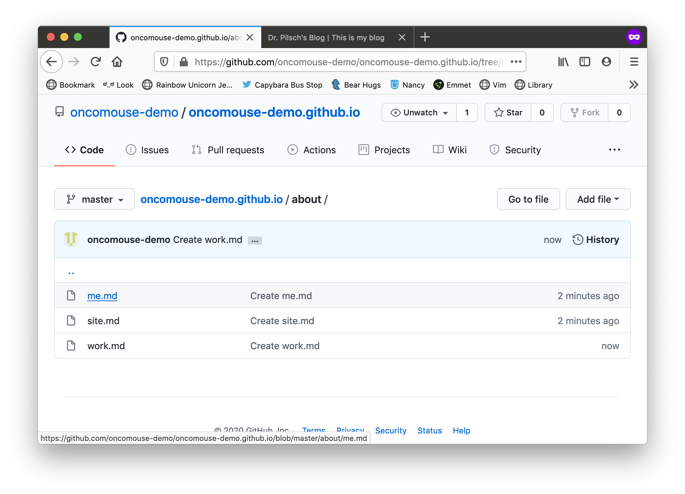
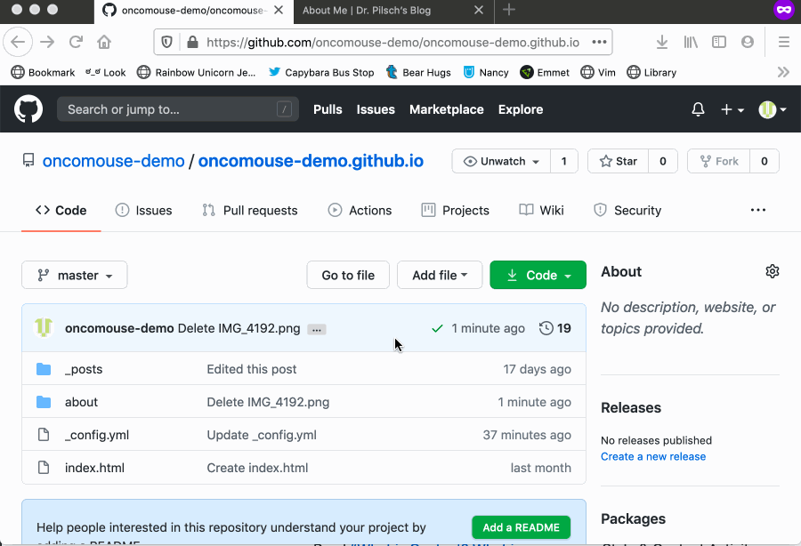

This exercise will ask you to learn a bit more about files in [Jekyll](https://jekyllrb.com), our course blogging software.

## Files and Folders in Jekyll

You've already blogged a few times, but it is worth mentioning again that each post on your Jekyll blog is a separate `.md` file in the `_posts` folder. The `_posts` folder is a special one in Jekyll because it houses blog posts. The full behavior of this folder is covered in the [Jekyll documentation](https://jekyllrb.com/docs/posts/).

### Special Folders and Files in Jekyll

Jekyll has several special directories like `_posts`. The full list is available on the ["Directory Structure"](https://jekyllrb.com/docs/structure/) page in the Jekyll documentation. Take a few minutes to look over that page.

We will be working with the `_includes` and `_layouts` folders in this exercise, so take a few minutes to make sure that one makes sense.

### Other Files and Folders in Jekyll

You can also create any other pages you want in Jekyll, outside of these special folders. Files that end in `.html` and `.md` are called "pages" in Jekyll's vocabulary, and they are the basic building blocks of a Jekyll site. We have already created one page when we made `index.html` when we set initially set up our blog.

But we can create pages to do any information we might want on our site. We can also use folders to organize our site for better maintainability (so we know where things are located).

Imagine a Jekyll site where we wanted to have some information about ourselves outside the blog. Say we wanted three pages:

1. About Me -- Which discussed the site author
1. About This Site -- Which discussed the focus of the blog
1. About My Work -- Which discussed the author as a professional

I could do this two ways:

1. Create three files at the root of my repository, `about-me.md`, `about-site.md`, and `about-work.md`
1. Create a folder in my root called `about/` and then add `me.md`, `site.md`, and `work.md` to that folder

The decision is partly one of aesthetics (do you mind lots of folders in your root or do prefer things grouped in like containers?), partly one of project management (is this site going to be complicated enough that conceptual groupings of files might be helpful?), and partly one of time (do I want to have to remember where I put things?).

I'm going to put these in a folder called `about/`, so I make three files on GitHub: `about/me.md`, `about/site.md`, and `about/work.md`.

`about/me.md`:

~~~markdown
---
layout: default
title: About Me
---

This page is about me!
~~~

`about/site.md`:

~~~markdown
---
layout: default
title: About This Site
---

This page is about my blog!
~~~

`about/work.md`:

~~~markdown
---
layout: default
title: About My Work
---

This page is about my job!
~~~

Now I have this:

<figure>

<figcaption>A directory named 'about/' with three files</figcaption>
</figure>

And I can see those pages if I vist the following URLs:

* [https://oncomouse-demo.github.io/about/me.html](https://oncomouse-demo.github.io/about/me.html)
* [https://oncomouse-demo.github.io/about/site.html](https://oncomouse-demo.github.io/about/site.html)
* [https://oncomouse-demo.github.io/about/work.html](https://oncomouse-demo.github.io/about/work.html)

Note how the URL mirrors the file structure in our repository: `/about/me.md` becomes `/about/me.html` when Jekyll makes the site, but we retain the folder structure.

### Adding Images

I can also add other kinds of files beside `.md`/`.html` files to my site. For instance, I might want to add an image to my about page. While you can link to images not hosted on your site, this practice is considered rude and some sites will actually block you from doing it. There are image ownership issues involved with hosting a file on your own site, however, so make sure you have ownership or permission to host an image before uploading it.

There are also lots of sites that host Public Domain images that can be used, often with attribution, for your own purposes: [https://www.google.com/search?q=public+domain+images](https://www.google.com/search?q=public+domain+images). Also, sites such as [Giphy](https://giphy.com) or [ImgUr](https://imgur.com) are designed for sharing images, so using images from those sites is fine.

I am going to upload an image I took in Cushing Library's Science Fiction & Fantasy collection, of George R.R. Martin's manuscripts for the *Game of Thrones* novels. In my repository, I navigate to the folder I want to upload into. I click the "Add File" button and select "Upload Files." I select the file I want to upload and *wait for it to finish uploading*. I then click "Commit" to finish adding the file.

Here's a GIF of the process:

<figure>

<figcaption>Uploading a file to GitHub</figcaption>
</figure>

Now we need to reference the file in our page.

I change the content of my `about/me.md` file to read:

~~~markdown
---
layout: default
title: About Me
---

This page is about me!

Here's a picture I took:

~~~

`IMG_4192.png` is the name of the file I uploaded. Because it is in the same folder as `me.md` (the `about` folder), I can just type the name of the file. This is called a relative URL. I could also type `/about/IMG_4192.png` if I wanted to give what is called an "absolute URL." Relative URLs locate other files in relation to the current file. Absolute URLs locate other files in relation to the root of the file system. The choice between absolute and relative URLs, for the moment, comes down to what you wish to do if files are moved. If you can the name of your `about` folder, all absolute URLs would have to be updated. If you move the location of the image file, all relative URLs would have to be updated.

### Other Media

It is also easy to add things like videos to your site, especially when they are hosted on services such as YouTube. Social sites such as Twitter also let you add tweets in the same way. We are going to "embed" an external resource in our page.

On YouTube, if you click the "Share" button and select "Embed," the site will display some HTML code. If you copy this to the clipboard, you can paste this embed code into your site to display a YouTube video.

The process is the same for displaying tweets on your site or videos from Vimeo.

Here's a GIF of adding a video to my about me page:

<figure>

<figcaption>Adding a video to a GitHub Page</figcaption>
</figure>

## Your Challenge

Create a Page on your Jekyll site.  You can incorporate any images or videos you want. It can be about any topic you like, but try to think of something that relates to your site. Maybe you'd like to post some photos from your travels? Or a list of work experience? Or your favorite animated GIFs?

Post the link to your page on your blog and talk about what you did and why.

Next week's exercise will cover how to incorporate this page into your overall site's design.
