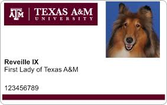

This exercise will ask you to learn a bit more about files and how we can interact with them using VSCode.

## Images in Markdown

To reiterate, images in Markdown can be inserted using the `` code, placed on their own line, like so:

~~~markdown

~~~

Which will produce:

Similarly, if I wanted to use an image file from my computer, I could put in the same folder as my Markdown document and write:

~~~markdown

~~~

Which will produce:

The `.` in the file path is a magic character to web browsers and programs such as Markdown that interact with files in more computational ways. It translates to "the current directory." So, if we had a file in a folder named `images` in the same directory as our Markdown document, we could type:

~~~markdown

~~~

Which will produce:

This works because I have two copies of the image file, one in the same folder as this document and one in the folder called `images` in the same folder as this document, by the by.

Another useful magic character in file names is `..`, which translates to "the parent folder of the current directory." My files are in a folder called `engl460`, so I could also type the same code I typed above as:

~~~markdown

~~~

Which will produce the same result:

I could do `..` as many times as I wanted, but computer users generally prefer concise solutions.

So, to recap:

1. `` is how we make an image with the description, "Description," and a file path of "file." This can be a URL from the Internet or a relative path using `.` (current directory) and/or `..` (parent of current directory)

## Other Media

It is also easy to add things like videos to your site, especially when they are hosted on services such as YouTube. Social sites such as Twitter also let you add tweets in the same way. We are going to "embed" an external resource in our page.

On YouTube, if you click the "Share" button and select "Embed," the site will display some HTML code. If you copy this to the clipboard, you can paste this embed code into your site to display a YouTube video.

The process is the same for displaying tweets on your site or videos from Vimeo.

Here's a GIF of adding a video to my about me page:

<figure>

<figcaption>Adding a video to a GitHub Page</figcaption>
</figure>

## Your Challenge

Create an "About Me" Markdown document. Provide some background about yourself and make use of the Markdown elements we have already learned (lists, paragraphs, blockquotes). Incorporate any images or videos you want. It can be about any topic you like, but try to think of something that relates to your site. Maybe you'd like to post some photos from your travels? Or a list of work experience? Or your favorite animated GIFs?

You can produce a webpage (in HTML) from Markdown in VSCode using the "Print Current Document in HTML" command from the Markdown All in One Plugin (accessed from the command palette). Submit your markdown file (`.md` extension), your HTML file (`.html` extension), and any images or movie files needed to display the HTML along with your lab report. You can upload multiple files in the same submission on Canvas, which you will need to do in order to complete this lab.
